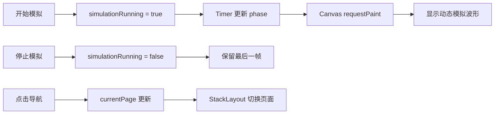

# 工业多通道示波记录软件：第一阶段开发记录

## 目录

1. [文档说明](#1-文档说明)
2. [项目范围](#2-项目范围)
3. [本阶段目标](#3-本阶段目标)
4. [开发过程](#4-开发过程)
5. [界面与状态设计](#5-界面与状态设计)
6. [文件说明](#6-文件说明)
7. [构建与运行验证](#7-构建与运行验证)
8. [当前限制](#8-当前限制)

---

## 1. 文档说明

本文记录 Qt 6 / Qt Quick 第一阶段界面原型的开发内容。文档与 `SoftwarePlaning.md` 一样，采用“目标、范围、约束、结果”的形式组织；它描述已完成的界面工作，不替代后续硬件、采集和录制设计。

### 1.1 状态标记

| 标记 | 含义 |
|---|---|
| 已完成 | 已实现为可见界面或模拟交互 |
| 模拟 | 仅使用 QML 内存状态和绘制数据 |
| 未实现 | 明确不属于本阶段的功能 |

---

## 2. 项目范围

项目沿用既有 CMake、C++20、Qt 6 与 Qt Quick/QML 工程结构。所有 QML 文件通过 `qt_add_qml_module` 登记；未修改 Qt Kit、MinGW、编译器路径或工具链设置。

本阶段不接入 PCIe、Xillybus、FPGA、真实采集卡、设备节点或文件系统数据写入。代码未使用 Windows API、硬编码项目路径或平台专用依赖，以便后续在 Linux / ARM64 环境继续验证。

---

## 3. 本阶段目标

| 目标 | 状态 | 结果 |
|---|---|---|
| 工业风格初始主界面 | 已完成 | 顶部状态、左侧导航、中央工作区、底部日志 |
| 模拟波形 | 已完成 | Canvas 网格与约 30 FPS 的青绿色动态波形 |
| 五个页面切换 | 已完成 | 使用 `StackLayout` 切换实时波形和四个占位页 |
| 状态联动 | 已完成 | 启停、系统状态、顶部状态及日志共用 Main.qml 状态 |
| 真实设备与录制 | 未实现 | 按本阶段边界保留 |

---

## 4. 开发过程

### 4.1 问题诊断

原波形代码仅更新 `waveformPhase`，没有显式通知 Canvas 重绘；Canvas 不能保证仅因外部属性变化而自动执行 `onPaint`。同时，绘制条件直接依赖运行状态，停止后会使最后一帧消失。导航组件只维护选中状态，没有向中央区域传递页面选择。

### 4.2 修复方案

1. 在 `Main.qml` 统一保存 `simulationRunning`、`hasSimulationData`、`waveformPhase`、`currentPage` 与 `logModel`。
2. Timer 以 33 ms 周期更新相位；`WaveformPanel.qml` 监听相位变化并调用 `waveformCanvas.requestPaint()`。
3. 绘制逻辑根据 `hasSimulationData` 决定是否绘制，使停止后保留最后一帧；再次开始时从当前相位继续。
4. 使用 `StackLayout` 将页面选择映射到唯一可见的中央页面。
5. 通过函数追加日志，最多保留最近 100 条。

### 4.3 交互流程



---

## 5. 界面与状态设计

### 5.1 页面

| 页面 | 内容 |
|---|---|
| 实时波形 | Canvas 网格、CH1 模拟波形、开始与停止按钮、参数栏 |
| 通道设置 | 四张 CH1–CH4 模拟状态卡片 |
| 采集设置 | 模拟采样率、通道数、模式与同步状态 |
| 数据录制 | 只读录制占位信息，不创建文件 |
| 系统状态 | 设备与资源模拟状态，采集状态与主界面联动 |

### 5.2 状态传递

`Main.qml` 是唯一状态持有者。`WaveformPanel.qml` 通过属性接收波形状态，通过信号请求开始或停止；`SystemStatusPage.qml` 接收同一份运行状态；`NavigationPanel.qml` 发出页面选择信号。子组件不自行维护另一份运行状态。

---

## 6. 文件说明

| 文件 | 作用 |
|---|---|
| `CMakeLists.txt` | 登记全部 QML 模块文件 |
| `Main.qml` | 主窗口、全局模拟状态、Timer、页面切换与运行日志 |
| `NavigationPanel.qml` | 五项导航按钮和选中状态 |
| `WaveformPanel.qml` | Canvas 网格、冻结/更新波形和启停按钮 |
| `ParameterPanel.qml` | CH1 只读模拟参数 |
| `ChannelSettingsPage.qml` | 通道设置占位页面 |
| `AcquisitionSettingsPage.qml` | 采集设置占位页面 |
| `RecordingPage.qml` | 数据录制占位页面 |
| `SystemStatusPage.qml` | 与运行状态联动的系统状态页 |

---

## 7. 构建与运行验证

建议在 VS Code 中使用项目原有 Qt 6 MinGW Kit 执行：

```powershell
cmake -S . -B build
cmake --build build
```

运行后应依次验证：五个导航页面切换；开始模拟后顶部状态变为“运行中”且波形连续变化；停止后按钮状态切换并保留最后一帧；切换页面后模拟状态不重置；日志追加页面切换、开始与停止记录。

本次在 Codex 受控终端中完成了 CMake 配置和 QML 静态检查；该终端的 MinGW 子进程无诊断退出，不能据此判断你的 VS Code Qt Kit 构建结果。

---

## 8. 当前限制

以下内容仍为模拟或未实现：设备连接、采集数据、磁盘空间、告警、通道配置下发、真实录制、触发、FFT、文件管理和远程控制。它们均不应在本阶段通过占位界面之外的方式实现。

---

## 9. 实时波形显示优化

### 9.1 本轮目标

本轮只增强“实时波形”页面，不修改其他四个占位页面的只读性质。目标是让 CH1 的模拟显示具有更接近稳定触发仪器波形的外观，并让右侧参数真正控制绘图结果。

| 项目 | 状态 | 说明 |
|---|---|---|
| 稳定模拟信号 | 已完成 | 基波叠加 8% 三次谐波与不超过约 2% 的确定性噪声 |
| 时基控制 | 已完成 | 水平按 10 格计算可见时间，改变每格时间会改变可见周期数 |
| 量程控制 | 已完成 | 垂直按 8 格计算，每格电压直接参与像素换算 |
| 垂直偏移 | 已完成 | 支持上移、下移、归零，范围限制为 -5 V 到 +5 V |
| CH1 显示开关 | 已完成 | 关闭时隐藏波形、保留网格和采集状态 |
| 自动适配与复位 | 已完成 | 自动适配选择 0.5 V/div；复位恢复默认显示参数 |

### 9.2 统一状态

`Main.qml` 继续作为唯一状态持有者。本轮新增 `channelEnabled`、`voltsPerDiv`、`timePerDivMs`、`verticalOffsetV`、`signalFrequencyHz` 和 `signalAmplitudeV`。`WaveformPanel.qml` 与 `ParameterPanel.qml` 通过属性使用同一份状态；右侧组件只发出请求信号，由 Main 统一写入状态与日志。

### 9.3 波形换算

水平可见时长为：`timePerDivMs × 10`；每个像素对应的时间由 Canvas 宽度计算。垂直每格的像素高度为 `Canvas.height / 8`，每伏像素数为“每格像素高度 / voltsPerDiv”。绘制坐标在中心线基础上叠加 `verticalOffsetV`，因此量程和偏移只影响显示，不改变模拟信号本身。

Timer 只驱动极小的幅度呼吸和确定性噪声变化；基波的时间坐标不发生整体平移，因此波形保持稳定。停止模拟后仍保留最后状态，调整时基、量程或偏移会重新绘制这最后一帧。

### 9.4 新增日志

以下用户操作会追加日志，Timer 刷新不会写日志：量程、时基、垂直偏移、CH1 开关、自动适配和显示复位。日志仍最多保留 100 条。

### 9.5 验证建议

在 VS Code 原有 Qt Kit 中构建并运行后，依次检查：开始/停止模拟；所有时基和量程选项；偏移上移、下移和归零；关闭再开启 CH1；自动适配和显示复位；切换其他页面再返回。应确认停止后的参数调整也能重新缩放和移动最后一帧波形。
