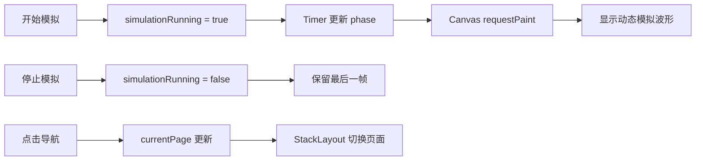

# 工业多通道示波记录软件：第一阶段开发记录

## 目录

1. [文档说明](#1-文档说明)
2. [项目范围](#2-项目范围)
3. [本阶段目标](#3-本阶段目标)
4. [开发过程](#4-开发过程)
5. [界面与状态设计](#5-界面与状态设计)
6. [文件说明](#6-文件说明)
7. [构建与运行验证](#7-构建与运行验证)
8. [当前限制](#8-当前限制)

---

## 1. 文档说明

本文记录 Qt 6 / Qt Quick 第一阶段界面原型的开发内容。文档与 `SoftwarePlaning.md` 一样，采用“目标、范围、约束、结果”的形式组织；它描述已完成的界面工作，不替代后续硬件、采集和录制设计。

### 1.1 状态标记

| 标记 | 含义 |
|---|---|
| 已完成 | 已实现为可见界面或模拟交互 |
| 模拟 | 仅使用 QML 内存状态和绘制数据 |
| 未实现 | 明确不属于本阶段的功能 |

---

## 2. 项目范围

项目沿用既有 CMake、C++20、Qt 6 与 Qt Quick/QML 工程结构。所有 QML 文件通过 `qt_add_qml_module` 登记；未修改 Qt Kit、MinGW、编译器路径或工具链设置。

本阶段不接入 PCIe、Xillybus、FPGA、真实采集卡、设备节点或文件系统数据写入。代码未使用 Windows API、硬编码项目路径或平台专用依赖，以便后续在 Linux / ARM64 环境继续验证。

---

## 3. 本阶段目标

| 目标 | 状态 | 结果 |
|---|---|---|
| 工业风格初始主界面 | 已完成 | 顶部状态、左侧导航、中央工作区、底部日志 |
| 模拟波形 | 已完成 | Canvas 网格与约 30 FPS 的青绿色动态波形 |
| 五个页面切换 | 已完成 | 使用 `StackLayout` 切换实时波形和四个占位页 |
| 状态联动 | 已完成 | 启停、系统状态、顶部状态及日志共用 Main.qml 状态 |
| 真实设备与录制 | 未实现 | 按本阶段边界保留 |

---

## 4. 开发过程

### 4.1 问题诊断

原波形代码仅更新 `waveformPhase`，没有显式通知 Canvas 重绘；Canvas 不能保证仅因外部属性变化而自动执行 `onPaint`。同时，绘制条件直接依赖运行状态，停止后会使最后一帧消失。导航组件只维护选中状态，没有向中央区域传递页面选择。

### 4.2 修复方案

1. 在 `Main.qml` 统一保存 `simulationRunning`、`hasSimulationData`、`waveformPhase`、`currentPage` 与 `logModel`。
2. Timer 以 33 ms 周期更新相位；`WaveformPanel.qml` 监听相位变化并调用 `waveformCanvas.requestPaint()`。
3. 绘制逻辑根据 `hasSimulationData` 决定是否绘制，使停止后保留最后一帧；再次开始时从当前相位继续。
4. 使用 `StackLayout` 将页面选择映射到唯一可见的中央页面。
5. 通过函数追加日志，最多保留最近 100 条。

### 4.3 交互流程



---

## 5. 界面与状态设计

### 5.1 页面

| 页面 | 内容 |
|---|---|
| 实时波形 | Canvas 网格、CH1 模拟波形、开始与停止按钮、参数栏 |
| 通道设置 | 四张 CH1–CH4 模拟状态卡片 |
| 采集设置 | 模拟采样率、通道数、模式与同步状态 |
| 数据录制 | 只读录制占位信息，不创建文件 |
| 系统状态 | 设备与资源模拟状态，采集状态与主界面联动 |

### 5.2 状态传递

`Main.qml` 是唯一状态持有者。`WaveformPanel.qml` 通过属性接收波形状态，通过信号请求开始或停止；`SystemStatusPage.qml` 接收同一份运行状态；`NavigationPanel.qml` 发出页面选择信号。子组件不自行维护另一份运行状态。

---

## 6. 文件说明

| 文件 | 作用 |
|---|---|
| `CMakeLists.txt` | 登记全部 QML 模块文件 |
| `Main.qml` | 主窗口、全局模拟状态、Timer、页面切换与运行日志 |
| `NavigationPanel.qml` | 五项导航按钮和选中状态 |
| `WaveformPanel.qml` | Canvas 网格、冻结/更新波形和启停按钮 |
| `ParameterPanel.qml` | CH1 只读模拟参数 |
| `ChannelSettingsPage.qml` | 通道设置占位页面 |
| `AcquisitionSettingsPage.qml` | 采集设置占位页面 |
| `RecordingPage.qml` | 数据录制占位页面 |
| `SystemStatusPage.qml` | 与运行状态联动的系统状态页 |

---

## 7. 构建与运行验证

建议在 VS Code 中使用项目原有 Qt 6 MinGW Kit 执行：

```powershell
cmake -S . -B build
cmake --build build
```

运行后应依次验证：五个导航页面切换；开始模拟后顶部状态变为“运行中”且波形连续变化；停止后按钮状态切换并保留最后一帧；切换页面后模拟状态不重置；日志追加页面切换、开始与停止记录。

本次在 Codex 受控终端中完成了 CMake 配置和 QML 静态检查；该终端的 MinGW 子进程无诊断退出，不能据此判断你的 VS Code Qt Kit 构建结果。

---

## 8. 当前限制

以下内容仍为模拟或未实现：设备连接、采集数据、磁盘空间、告警、通道配置下发、真实录制、触发、FFT、文件管理和远程控制。它们均不应在本阶段通过占位界面之外的方式实现。

---

## 9. 实时波形显示优化

### 9.1 本轮目标

本轮只增强“实时波形”页面，不修改其他四个占位页面的只读性质。目标是让 CH1 的模拟显示具有更新模式的完整帧外观，并让右侧参数真正控制绘图结果。

| 项目 | 状态 | 说明 |
|---|---|---|
| 更新模式模拟信号 | 已完成 | 基波叠加 8% 三次谐波与不超过约 2% 的确定性噪声 |
| 时基控制 | 已完成 | 水平按 10 格计算可见时间，改变每格时间会改变可见周期数 |
| 量程控制 | 已完成 | 垂直按 8 格计算，每格电压直接参与像素换算 |
| 垂直偏移 | 已完成 | 支持上移、下移、归零，范围限制为 -5 V 到 +5 V |
| CH1 显示开关 | 已完成 | 关闭时隐藏波形、保留网格和采集状态 |
| 自动适配与复位 | 已完成 | 自动适配选择 0.5 V/div；复位恢复默认显示参数 |

### 9.2 统一状态

`Main.qml` 继续作为唯一状态持有者。本轮新增 `channelEnabled`、`voltsPerDiv`、`timePerDivMs`、`verticalOffsetV`、`signalFrequencyHz` 和 `signalAmplitudeV`。`WaveformPanel.qml` 与 `ParameterPanel.qml` 通过属性使用同一份状态；右侧组件只发出请求信号，由 Main 统一写入状态与日志。

### 9.3 波形换算

水平可见时长为：`timePerDivMs × 10`；每个像素对应的时间由 Canvas 宽度计算。垂直每格的像素高度为 `Canvas.height / 8`，每伏像素数为“每格像素高度 / voltsPerDiv”。绘制坐标在中心线基础上叠加 `verticalOffsetV`，因此量程和偏移只影响显示，不改变模拟信号本身。

Timer 驱动缓慢幅度、基线、确定性噪声和事件变化；更新模式使用相对时间锁定基波位置，停止模拟后保留最后一帧。

### 9.4 新增日志

以下用户操作会追加日志，Timer 刷新不会写日志：量程、时基、垂直偏移、CH1 开关、自动适配和显示复位。日志仍最多保留 100 条。

### 9.5 验证建议

在 VS Code 原有 Qt Kit 中构建并运行后，依次检查：开始/停止模拟；所有时基和量程选项；偏移上移、下移和归零；关闭再开启 CH1；自动适配和显示复位；切换其他页面再返回。应确认停止后的参数调整也能重新缩放和移动最后一帧波形。

---

## 10. 单通道历史与滚动显示

### 10.1 本轮目标

本轮只增强实时波形页：保留更新显示，并增加真正由历史样本驱动的滚动显示、历史回看、清除历史和严格按用户操作写入的日志。其他四个占位页未修改。

### 10.2 历史缓冲设计

CH1 的模拟历史保存在 `Main.qml` 中的固定容量环形缓冲。采样率为 5 kSa/s，容量为 100,000 点，约对应 20 秒数据。每 20 ms 生成 100 个连续时间戳样本；缓冲写满后仅覆盖最旧样本，因此内存不会随运行时长增长。

滚动显示不通过移动 Canvas 或修改单一正弦相位实现。它以最新样本时间为右边界，按 `timePerDivMs × 10` 建立可见时间窗，再从环形缓冲选取窗口内样本映射到 X/Y 坐标。实时跟随时新数据在右侧进入、旧数据视觉上向左移；回看时保持当前观察窗，后台采样继续追加。

### 10.3 显示模式与回看

| 控件 | 行为 |
|---|---|
| 更新 | 使用完整显示帧重复更新，周期位置固定，仍受时基、量程和偏移控制 |
| 滚动 | 使用历史缓冲实时跟随；若时基小于 20 ms/div，自动设为 100 ms/div |
| ← 回看 | 向历史方向移动半个当前可见时间窗 |
| 前进 → | 向最新方向移动半个可见时间窗 |
| 回到最新 | 恢复实时跟随 |
| 清除历史 | 清空 CH1 缓冲并恢复“等待采集数据”状态，不改变采集启停状态 |

停止模拟后不再写入新样本，但既有历史仍可回看，也可重新按时基、量程和偏移重绘。

### 10.4 日志规则

日志统一由 `Main.qml` 的用户操作函数写入，格式为 `[HH:mm:ss] [级别] 内容`。日志按时间从上到下排列，最新项位于底部，新增项自动滚动到底部，最多保留 100 条。Timer、Canvas 重绘和样本生成不会写日志；自动适配、复位和模式自动调整各只写一条最终结果日志。

### 10.5 构建诊断说明

受控终端会执行 CMake 配置、QML 静态检查和构建复核。此前构建失败发生在 Qt 自动生成的 QML 缓存 C++ 文件进入 MinGW 编译阶段，编译器没有返回可用诊断文本；这与项目源码的 QML 静态检查结果无关。本轮将继续以不修改 Qt Kit、MinGW 或工具链设置为前提进行最小复现检查；若仍不能取得编译器诊断，应以 VS Code 中已正常工作的 Kit 进行实际运行与交互验证。

---

## 11. 历史窗口与位置控制优化

本轮仅修改实时波形相关的 `Main.qml`、`WaveformPanel.qml` 与 `ParameterPanel.qml`，其他四个页面没有改变。

### 11.1 历史样本与可辨识信号

CH1 继续使用 5 kSa/s、100,000 点（约 20 秒）的固定容量环形缓冲。每个样本在写入时就确定，绘制时不会重新生成随机值。模拟信号由 500 Hz 基波、8% 三次谐波、约 ±12% 的 0.09 Hz 幅度调制、0.045 Hz 的缓慢基线漂移、低于 2% 的确定性噪声，以及每 4.7 秒约 220 ms 的短暂负脉冲组成。因此，回看不同时间窗会从环形缓冲取到不同的真实历史样本。

更新显示和滚动显示在历史回看时都会从同一个历史窗口绘制；实时跟随时更新模式改用完整显示帧。停止模拟只停止新样本写入，不影响回看。

### 11.2 统一状态与时间标签

`Main.qml` 是唯一状态持有者：`verticalOffsetV` 管理垂直位置；`historyOffsetSeconds` 管理距最新数据的水平偏移；`followLatest` 表示是否实时跟随。`WaveformPanel.qml` 与 `ParameterPanel.qml` 只接收这些状态并发出操作请求，不保存副本。

可见窗口恒为 `timePerDivMs × 10`。右边界是 `-historyOffsetSeconds`，左边界是右边界减去可见窗口，因此波形底部的两个相对时间标签会随着左移、右移和归零同步变化，并按范围自动显示 ms 或 s。

### 11.3 水平位置控制

“水平位置”位于右侧参数栏的时基下方：左移和右移每次移动当前可见时间的 50%，归零回到最新数据。没有样本时三个按钮均禁用；到最早历史时左移禁用；位于最新时右移和归零禁用。历史移动、归零和边界判断均由 Main 统一处理，每次有效用户操作只追加一条日志。

### 11.4 垂直适配与位置复位

“垂直适配”只分析当前可见历史窗口的最小值和最大值。它选择允许档位中满足 `peakToPeak ≤ voltsPerDiv × 8 × 0.8` 的最小量程，并将 `verticalOffsetV` 设置为负的窗口中点，使波形居中并保留约 20% 余量。无有效样本时仅记录提示日志。

“位置复位”只将 `verticalOffsetV` 归零，并将 `historyOffsetSeconds` 归零、`followLatest` 设为 true；它不修改量程、时基、显示模式、通道状态、采集状态或历史缓冲。清除历史同样只清空样本并恢复实时跟随，不改变显示参数。

### 11.5 构建与验证

在已配置的 Qt 6 MinGW 构建目录中执行：

```powershell
cmake --build build\Desktop_Qt_6_11_1_MinGW_64_bit_Debug --parallel 1
```

运行后，先开始模拟并等待至少 20 秒以观察慢变化和脉冲事件；再分别在更新、滚动模式中左移、右移和归零，检查顶部距离、底部时间范围以及实际波形窗口同步更新。随后停止模拟，确认历史仍可移动；执行垂直适配和位置复位，确认前者只改量程与垂直偏移，后者保留量程、时基和显示模式。

---

## 12. 更新帧、滚动显示与栅格控制

本轮将原“稳定”显示正式更名为“更新”，内部状态为 `displayMode: "update"`；另一取值仍为 `"roll"`。只有实时跟随时两种模式的绘制方式不同。历史偏移不为零时，两种模式都会显示环形缓冲中对应的真实历史窗口。

### 12.1 更新模式

`Main.qml` 持有有限的 `updateFrameSamples`。每当模拟批次、时基或 Canvas 宽度变化时，`WaveformPanel.qml` 按 `clamp(round(canvasWidth × 2), 1024, 4096)` 请求一帧新样本。样本索引从 0 到 `pointCount - 1`，X 坐标映射为 `index / (pointCount - 1) × plotWidth`，因此无论时基多小，首尾都精确覆盖绘图区。

帧内基波和三次谐波使用从 0 开始的相对时间，保证每次替换帧时周期位置基本固定。幅值、基线、确定性噪声和短暂事件继续使用实际模拟时间，因而画面会缓慢更新，而不是冻结成完全相同的曲线。停止模拟会保留最后一帧。

### 12.2 滚动与历史窗口

滚动模式只绘制历史环形缓冲中以最新样本为右边界的时间窗口，新数据从右侧进入，旧数据向左移动。进入历史回看后，`historyOffsetSeconds` 固定当前窗口，后台采集不能将视图拉回最新；归零后才按当前显示模式恢复更新或滚动。若缓冲尚不足一屏，左侧保持真实空白，并显示“历史数据积累中”。

### 12.3 栅格显示

新增由 `Main.qml` 统一保存的 `gridVisible`，默认开启。右侧参数栏在“显示模式”之后提供深色样式的“开启/关闭”按钮。关闭时只跳过 10×8 栅格绘制；深色背景、波形、零电平虚线、状态提示、量程时基和底部时间范围都会保留。状态实际变化时仅追加一条对应日志。

### 12.4 回归边界

垂直适配仍只修改 `voltsPerDiv` 与 `verticalOffsetV`；位置复位仍只恢复垂直偏移、水平偏移和实时跟随。两者都不会更改更新/滚动模式、栅格状态、时基、历史缓冲或模拟采集状态。其他四个页面没有修改。

---

## 13. 时基范围、历史定位与绘制预算

当前模拟原型支持的时基为 0.1、0.2、0.5、1、2、5、10、20、50、100 和 200 ms/div；500 ms/div、1 s/div 及更大的选项已移除。若调用方请求超过 200 ms/div，`Main.qml` 会限制为 200 ms/div，并只记录一条上限调整日志。

### 13.1 水平步长与中心保持

水平移动统一由 `Main.qml` 的 `horizontalStepSeconds = timePerDivMs / 1000` 计算，因此一次左移或右移正好是一个水平大格。右侧“水平位置”会同步显示当前移动步长。所有内部计算使用浮点秒，并在极小容差内将接近零的偏移归零。

历史回看期间切换时基时，程序先计算旧窗口中心：`latestTime - historyOffsetSeconds - oldVisibleTime / 2`，再以新窗口宽度反推新的右边界和偏移。这样缩放时会优先保留正在观察的异常位置；只有触及缓冲边界时才裁剪。实时跟随状态则保持偏移为零。

### 13.2 高效历史窗口绘制

Canvas 不再从逻辑索引 0 扫描整个环形缓冲。它根据 `historyStartTime`、固定采样周期和当前窗口的起止时间直接计算首末逻辑索引，只处理可见样本。最大显示点数为 `clamp(round(plotWidth × 2), 1024, 4096)`。

可见样本超过预算时，绘制代码按时间桶保留每桶的首点、最小值、最大值和末点，并按时间顺序输出。这是仅用于显示的 min/max 降采样，不会修改历史样本；短脉冲和峰值不会因简单隔点抽样而被轻易遗漏。实时 Canvas 绘制还通过 33 ms 单次定时器限至约 30 FPS，非实时页面不持续请求重绘。

若历史窗口真实样本不足 20 点，界面会保留已有点并提示“当前历史采样点较少”；不会伪造或外推数据。更新模式的完整高分辨率帧不受此提示影响。
