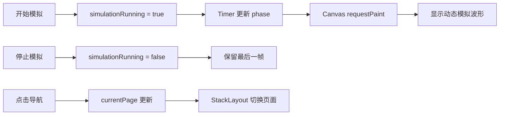

# 工业多通道示波记录软件：第一阶段开发记录

## 目录

1. [文档说明](#1-文档说明)
2. [项目范围](#2-项目范围)
3. [本阶段目标](#3-本阶段目标)
4. [开发过程](#4-开发过程)
5. [界面与状态设计](#5-界面与状态设计)
6. [文件说明](#6-文件说明)
7. [构建与运行验证](#7-构建与运行验证)
8. [当前限制](#8-当前限制)

---

## Acquisition configuration

`AcquisitionBackend` owns the board capability table. The acquisition-settings page has no free-form sample-rate input and does not hard-code a numeric range: every board/group selects only a rate returned by `ratesForBoard()`. The current conservative table is explicitly marked as pending hardware confirmation and deliberately contains no unverified 5 M or 50 M S/s production tier. Replace that C++ table with firmware-reported capabilities when physical boards are connected.

Hardware board rate, simulation-generation rate, display refresh rate and `time/div` are independent. Each enabled board has a per-channel hardware rate; the UI reports `hardware estimated throughput` as the sum of `enabled channels per board × board rate × 4 bytes`. It separately reports `simulation-generation throughput` as `all enabled channels × simulation stress rate × 4 bytes`. The simulation-only stress-rate selector is provided by a separate backend list and is clearly labelled as non-hardware capability. The sole simulator timer is paced by a fixed 50 FPS display refresh policy; its batch sample count derives only from the separate simulation-generation rate. `time/div` only changes the visible waveform time window.

While acquisition or recording is active, settings changes are staged only. The explicit “stop and apply” action safely stops acquisition (and an active recording), then applies the staged board rates, mode and channel selection. Configuration application, start, stop and validation failures continue to be logged. Acquisition can use all 64 channels while display remains independently capped at eight waveforms.

## Simulated recording and portable storage

`RecorderBackend` is the single recording-state model. Its default directory is `QStandardPaths::DocumentsLocation/OscRecorder`; the QML `FolderDialog` converts a selected `QUrl` with `toLocalFile()` before handing it to the backend. `QDir`, `QFileInfo`, and `QStorageInfo` handle local paths, write checks, and target-volume capacity without platform-specific mount points or drive letters.

## System information and diagnostics

System information is no longer a primary navigation item. It remains reachable through the top-right gear button without changing the existing `system` route. `SystemInfoBackend` uses Qt cross-platform paths to persist the applied runtime configuration under `AppConfigLocation` and the application event log under `AppLocalDataLocation/logs`. The compact page shows only software version/build information, platform, current data-source type, configuration path, and log path. It can open the log directory through `QDesktopServices` and export a JSON diagnostic report. CPU, temperature, write-rate, cache-use, and drop-state placeholders are intentionally absent; recording-specific storage statistics remain on the recording page. The backend is the extension point for later RK3588 temperature, board health, update, and hardware-diagnostic integrations.

Global application logs are appended through a background buffered writer, never directly from the GUI, acquisition, or recording path. `application.log` rotates at 10 MiB into timestamped archives. On startup and after background flushes, the global log directory removes files older than 14 days and then removes the oldest remaining files until total usage is at most 200 MiB. Identical high-frequency global messages are limited to one per second. The in-memory `运行日志 / Event Log` list is independent of disk retention and keeps the latest 500 entries. Each recording session has a separate `recording.log`; it contains only session creation, safe-stop, sealing, validation, write error, gap, and abnormal-stop information, and is flushed before the session directory is renamed.

The theoretical acquisition rate is `sampleRate × enabledChannels × 4 bytes`. Recording requires active acquisition. `RealtimeDataBackend` generates the base signal and applies stochastic events once, by global sample index, before any display extraction. That exact post-event raw block is then used for real-time history, source-side trigger detection, and recording; the recorder never regenerates a second waveform. Each acquired batch is queued and flushed as interleaved, little-endian float32 values in explicit `channelIds` order. Dropout samples are stored as `NaN` and mark the corresponding block as containing a gap. `waveform.part` has an absolute start-time file header; its blocks use relative float32 start time from the first acquired block, first sample sequence, count, gap flag, payload byte count, CRC-32, and a final commit marker. Individual samples never repeat timestamps; replay reconstructs their time from the block start plus `sampleSequence / sampleRate`. Safe stop flushes pending blocks, validates every `index.csv` offset/sequence/CRC against the data-file size, then seals it as `waveform.bin`. The final directory is named `recording_yyyyMMdd_HHmmss_zzz/` using stop time and contains `session.json`, `waveform.bin`, `index.csv`, and `recording.log`. `session.json` version 2 records `formatVersion`, `sampleType`, `byteOrder`, explicit zero-based channel indexes with `CHn` display names, sample count, `dataDurationSeconds`, `wallDurationSeconds` calculated strictly from `finishedAt - startedAt`, and `activeRecordingSeconds` for the effective run time before stop/flush work. It also records millisecond-precision start/end time, final status, size, and gap count—but no sample payload. The recording log records successful `.part` validation and rename to `waveform.bin`. A disabled “include time column” control reserves the later CSV-export policy. Statuses are `not_ready`, `ready`, `recording`, `stopping`, `completed`, `insufficient_space`, `path_not_writable`, and `write_error`. Stopping acquisition safely stops an active recording first.

## History playback

Clicking the real-time waveform navigation item expands **History Playback**. The single **Open Recording** action opens a local session-directory picker; the backend finds `session.json`, `waveform.bin`, and `index.csv` automatically. `PlaybackBackend` requires `formatVersion: 2`, `finalStatus: completed`, little-endian `float32`, explicit channel identifiers, `waveform.bin`, and `index.csv`. It compares JSON and raw-file sizes, checks index order and payload lengths, then reads every block header and CRC/commit marker sequentially for validation. Playback keeps only the index metadata in memory; waveform points are decoded from float32 interleaved blocks that intersect the active time window, never by loading the complete raw data file at once. The page is independent of `ChannelStore` and the acquisition timer. Its compact main page shows only sample rate, recorded-channel total, data duration, file size/gaps, and a **Select Channels N/8** action. The in-page selection popup groups choices by eight-channel boards; unrecorded boards/channels are disabled, while selection remains a draft until **Apply and Close**. The first eight recorded channels are selected by default, at most eight can be selected, and each selected channel owns exactly one dynamically sized view. “Recorded channel total” always means the number stored in the file, whereas “currently displayed N/8” means the independently selected playback views. Pan, zoom, and reset apply one shared time window to every selected view. Missing files, unsupported versions, incomplete sessions, index mismatches, CRC errors, and an empty display selection are reported explicitly. The CSV time-column UI is hidden; its recording-side interface remains reserved for a later export feature.

## Real-time waveform cache and adaptive rendering

`RealtimeDataBackend` owns real-time simulated generation, the fixed-capacity raw ring buffer and all display decimation; `ChannelStore.qml` now contains only channel metadata and presentation settings. A single acquisition call appends one common sample-index range for all enabled channels. The backend incrementally updates fixed-capacity 4× min/max levels (raw, 4, 16, 64 … samples per bucket) as each new block arrives. Disabled channels are represented by a compact validity mask and do not incur raw-value or min/max update work. It never rescans a full raw history on a display frame.

### Deterministic simulated test events

The acquisition-settings page provides an optional simulated-test-event switch: **Off** (default) or **Automatic random**. A fresh Qt cross-platform random seed is generated for each acquisition generation, while all scheduling still uses the common C++ global `sampleIndex`, never QML frames or timer cadence. Each enabled channel owns an independent non-overlapping 1–5 second event schedule, so simultaneous channels no longer receive copies of the same event. Events include spike, recovering step, short pulse, short acquisition interruption, and noise burst. Every emitted event carries its ID, type, channel, start sample, duration, amplitude, and run seed to the runtime log. Interruptions clear the raw validity mask, so both raw and envelope rendering break the curve across the gap rather than interpolating a false connection. The basic trigger monitor likewise evaluates only consecutive finite raw samples and resets across gaps; it does not inspect the simulator event list.

The base simulator now assigns distinct waveform families to the first eight channels—square, triangle, sawtooth, dual-tone sine, DC-offset sine, low-noise sine, periodic pulse, and amplitude-modulated sine—then cycles those families for CH9–CH64 with different frequency, amplitude, phase, and DC parameters. Every value is calculated from the common sample index and current sample rate; source frequency is clamped below the Nyquist limit (with additional dual-tone headroom). Existing test events are applied only after this base value is generated, so they augment rather than replace the waveform.

Every frame creates one immutable shared display snapshot for all visible channels. `displayDuration = timePerDiv × 10`, `visibleSampleCount = sampleRate × displayDuration`, and `samplesPerPixel = visibleSampleCount / plotWidth` select the rendering form: at `samplesPerPixel >= 2` the closest min/max level supplies at most about two true-time-ordered extrema per pixel; at lower densities the backend supplies only real raw points. Repeated requests with the same window, plot width, visible-channel set and data revision reuse the existing snapshot. QML receives only this compact current-window snapshot and Canvas draws it once, without per-channel timers or raw-history traversal.

The real-time cache is a fixed-`dt` generation. If the applied simulation sampling rate changes while stopped, the application immediately invalidates the old live history and starts a new cache generation before the new rate reaches the waveform page; old-rate samples are never interpreted with the new `dt`. As an additional guard, snapshot density uses the greater of theoretical and actual retained sample density, so a rate transition can never select an oversized raw-point transfer. Clearing history is also generation-based: it advances a cache epoch instead of filling 64 raw arrays with invalid values, so clearing remains immediate even after a high-rate multi-channel run.

The display refresh remains a fixed 50 FPS and is independent from acquisition rate. Left/right/reset/roll alter only the shared window state. The display control provides interpolation `自动 / 无 / 线性 / 方波 / 正弦`; it affects raw-point joining only, never the C++ cache, recorder, playback, or export data. “方波” holds the previous sample until the next sample; “正弦” uses a bounded half-cosine connection between adjacent real samples. Invalid or absent samples are not joined.

## Waveform timebase and anti-aliasing

Waveform rendering reads the fixed-capacity history buffer using each sample's timestamp, not a current sample-rate-derived index or a display-frame-generated signal. Changing ms/div only changes the visible time window; it does not reset time, phase, history, or the signal generator. When the visible sample count fits the Canvas width, every raw point is drawn. Larger windows use a min/max envelope per pixel column, preventing the fixed-stride aliasing that previously made high-frequency channels appear as false low-frequency or beat signals. Changing timebase records a fixed 100 ms zero-crossing frequency check for enabled CH1-CH8 in the runtime log.

Continuous simulation batching follows elapsed monotonic time, not a hard-coded display-frame duration. Each batch is still sampled with fixed `dt = 1 / simulationRate`; the 50 FPS display only decides when accumulated samples are painted. This prevents the UI cadence itself from deterministically re-sampling different channels at channel-dependent phase intervals.

Real-time horizontal navigation has exactly one shared window in `Main.qml`: `sharedWindowStart`, `sharedWindowEnd`, `sharedLatestTime`, and `sharedHistoryOffset`. Left/right/reset/roll only modify that shared state. Each C++ acquisition append records one common sample-index range before iterating enabled channels. `RealtimeDataBackend` derives all snapshot X coordinates from that common index and fixed `dt = 1 / sampleRate`; one horizontal move therefore advances exactly `time/div × sampleRate` samples (one grid division) for every visible curve, without accumulated floating-point time-to-pixel drift.

For views with more samples than pixel columns, the renderer draws the true min/max envelope for each shared X column. It never uses a fixed stride, so high-frequency CH6–CH8 do not acquire a false low-frequency or beat waveform merely because the display is zoomed out.


## Real-time waveform revision (2026-07-20)

This revision is limited to the real-time waveform page and four-channel simulated acquisition.

### Follow-up fixes

Update mode now calls `Canvas.requestPaint()` directly after rebuilding a frame; it no longer relies on a 33 ms deduplication timer. Simulation enters the running state before its first sample batch is written, so the state transition, sample revision, frame revision, and first Canvas request form one reliable sequence.

Update-frame arrays are kept outside `ListModel` roles in `ChannelStore.qml`. Canvas now reads the store-owned frame directly, avoiding ambiguous array-role propagation during a repaint.

When a channel is disabled, `ChannelStore` preserves its most recent update frame instead of regenerating it. Update-mode Canvas rendering uses that retained frame, so a visible disabled channel freezes immediately; enabling it resumes fresh sample and frame generation.

The parameter panel now uses one normal current-channel dropdown. It changes the channel targeted by the vertical and history controls only.

Channel visibility and acquisition enablement are now managed only on the channel-settings page. The real-time parameter panel contains a normal current-channel selector for vertical and history controls. Its waveform legend strip scrolls horizontally by mouse drag when the visible-channel list exceeds the available width.

### 64-channel (8 boards × 8 channels) simulation

`ChannelStore.qml` now initializes one `ListModel` containing CH1–CH64. Each record includes `boardIndex` (0–7), `channelIndex` (0–7), enabled/visible/selected state, name, color, volts/division, offset, simulation parameters, and room for a future PCIe/Xillybus source adapter. CH1–CH4 are enabled and visible by default; CH5–CH64 start disabled and hidden to bound normal CPU and Canvas load.

There is still exactly one 20 ms acquisition timer in `Main.qml`, one shared timestamp ring, and one Canvas. The store writes samples in a batch for enabled channels, while update-mode display frames are built only for visible and enabled channels. Canvas limits its draw-point budget to 1024–4096 points per visible waveform; history uses a fixed 100,000-sample ring per possible channel, so retained data has a hard upper bound and never grows without limit over run time.

For verification, start simulation with the default four channels, then use the channel settings page to enable/show channels from several boards. Confirm the legend strip can be dragged horizontally, hidden channels do not receive display frames, and repeated start/stop does not create additional timers. The QML/C++ design uses only Qt Quick and standard QML/JavaScript facilities, with no Windows API or platform-specific path assumptions; it remains compatible with the Qt 6.8+ / C++20 project configuration and Linux ARM64 targets.

### Dynamic multi-view waveform layout

Each enabled, visible channel maps to exactly one waveform view. The page begins with CH1 only; enabling another channel appends one view, and disabling a channel removes its view. Between one and eight channels are supported. Non-fixed counts such as 3, 5, and 7 are arranged as equal-height vertical regions that fill the Canvas without empty placeholders. Channel order follows the 64-channel model order.

All views share one Canvas, one time axis, one `ChannelStore`, and the same ring buffers. Each region draws one curve plus its name, color, latest value, V/div, zero reference, and separator grid. Display work is capped at eight enabled channels; update-mode frame generation receives only those channel indices, while the per-view point budget is capped at 256–2048 points and reduced to 512 points for higher view counts. Acquisition batches and retained history are not interrupted by channel additions, removals, or reordering.

To verify: start on the CH1 single view, enable channels to produce 2–8 equal-height views, then disable middle channels and confirm the remaining views reflow without clearing history. Stop sampling and inspect retained curves/history. No additional per-channel timers, canvas instances, or acquisition buffers are created.

The left navigation is a dedicated full-height column, spanning both the workspace and the log area. On the real-time page, channel parameters are likewise a single full-height right column; the central column contains the waveform workspace above the five-line event log, so no lower-right placeholder remains. Its bilingual `运行日志 / Event Log` heading contains a compact `中文 / English` selector: it changes the language of newly appended log messages only and does not affect acquisition, display mode, or navigation behavior. The log remains capped at 500 entries.

Clearing history is also an explicit empty-frame transition in both waveform modes. In update mode, the generated display frame is invalidated while the history buffer is empty, preventing the pre-clear curve from being redrawn; fresh samples resume normal rendering on the next shared acquisition batch.

- `Main.qml` owns the single `simulationRunning` state and the single 20 ms shared acquisition timer.
- `ChannelStore.qml` owns fixed-capacity per-channel history buffers; `sampleRevision` advances after each batch and `frameRevision` after frame generation.
- `WaveformPanel.qml` observes those revisions and requests a coalesced Canvas repaint. Starting simulation inserts an immediate first batch, so a waveform appears without waiting for a later timer tick.
- CH1–CH4 controls change only `visible`; a newly shown channel becomes selected. Legends are created from the visible model entries and only select channels.

| State | Meaning |
|---|---|
| `enabled` | Generates new simulated samples; retained history is preserved. |
| `visible` | Draws the channel only; it is independent of `enabled`. |
| `selectedChannelIndex` | Selects the channel edited by the parameter panel. |

The page keeps one shared time axis, one Canvas, fixed-capacity history, update/scroll modes, and no per-channel timers. Hardware, PCIe, recording, FFT, and trigger functionality remain out of scope.

## 1. 文档说明

本文记录 Qt 6 / Qt Quick 第一阶段界面原型的开发内容。文档与 `SoftwarePlaning.md` 一样，采用“目标、范围、约束、结果”的形式组织；它描述已完成的界面工作，不替代后续硬件、采集和录制设计。

### 1.1 状态标记

| 标记 | 含义 |
|---|---|
| 已完成 | 已实现为可见界面或模拟交互 |
| 模拟 | 仅使用 QML 内存状态和绘制数据 |
| 未实现 | 明确不属于本阶段的功能 |

---

## 2. 项目范围

项目沿用既有 CMake、C++20、Qt 6 与 Qt Quick/QML 工程结构。所有 QML 文件通过 `qt_add_qml_module` 登记；未修改 Qt Kit、MinGW、编译器路径或工具链设置。

本阶段不接入 PCIe、Xillybus、FPGA、真实采集卡、设备节点或文件系统数据写入。代码未使用 Windows API、硬编码项目路径或平台专用依赖，以便后续在 Linux / ARM64 环境继续验证。

---

## 3. 本阶段目标

| 目标 | 状态 | 结果 |
|---|---|---|
| 工业风格初始主界面 | 已完成 | 顶部状态、左侧导航、中央工作区、底部日志 |
| 模拟波形 | 已完成 | Canvas 网格与约 30 FPS 的青绿色动态波形 |
| 五个页面切换 | 已完成 | 使用 `StackLayout` 切换实时波形和四个占位页 |
| 状态联动 | 已完成 | 启停、系统状态、顶部状态及日志共用 Main.qml 状态 |
| 真实设备与录制 | 未实现 | 按本阶段边界保留 |

---

## 4. 开发过程

### 4.1 问题诊断

原波形代码仅更新 `waveformPhase`，没有显式通知 Canvas 重绘；Canvas 不能保证仅因外部属性变化而自动执行 `onPaint`。同时，绘制条件直接依赖运行状态，停止后会使最后一帧消失。导航组件只维护选中状态，没有向中央区域传递页面选择。

### 4.2 修复方案

1. 在 `Main.qml` 统一保存 `simulationRunning`、`hasSimulationData`、`waveformPhase`、`currentPage` 与 `logModel`。
2. Timer 以 33 ms 周期更新相位；`WaveformPanel.qml` 监听相位变化并调用 `waveformCanvas.requestPaint()`。
3. 绘制逻辑根据 `hasSimulationData` 决定是否绘制，使停止后保留最后一帧；再次开始时从当前相位继续。
4. 使用 `StackLayout` 将页面选择映射到唯一可见的中央页面。
5. 通过函数追加日志，最多保留最近 100 条。

### 4.3 交互流程



---

## 5. 界面与状态设计

### 5.1 页面

| 页面 | 内容 |
|---|---|
| 实时波形 | Canvas 网格、CH1 模拟波形、开始与停止按钮、参数栏 |
| 通道设置 | 四张 CH1–CH4 模拟状态卡片 |
| 采集设置 | 模拟采样率、通道数、模式与同步状态 |
| 数据录制 | 只读录制占位信息，不创建文件 |
| 系统状态 | 设备与资源模拟状态，采集状态与主界面联动 |

### 5.2 状态传递

`Main.qml` 是唯一状态持有者。`WaveformPanel.qml` 通过属性接收波形状态，通过信号请求开始或停止；`SystemStatusPage.qml` 接收同一份运行状态；`NavigationPanel.qml` 发出页面选择信号。子组件不自行维护另一份运行状态。

---

## 6. 文件说明

| 文件 | 作用 |
|---|---|
| `CMakeLists.txt` | 登记全部 QML 模块文件 |
| `Main.qml` | 主窗口、全局模拟状态、Timer、页面切换与运行日志 |
| `NavigationPanel.qml` | 五项导航按钮和选中状态 |
| `WaveformPanel.qml` | Canvas 网格、冻结/更新波形和启停按钮 |
| `ParameterPanel.qml` | CH1 只读模拟参数 |
| `ChannelSettingsPage.qml` | 通道设置占位页面 |
| `AcquisitionSettingsPage.qml` | 采集设置占位页面 |
| `RecordingPage.qml` | 目录选择、容量估算、会话状态和模拟录制控制页面 |
| `SystemStatusPage.qml` | 与运行状态联动的系统状态页 |

---

## 7. 构建与运行验证

建议在 VS Code 中使用项目原有 Qt 6 MinGW Kit 执行：

```powershell
cmake -S . -B build
cmake --build build
```

运行后应依次验证：五个导航页面切换；开始模拟后顶部状态变为“运行中”且波形连续变化；停止后按钮状态切换并保留最后一帧；切换页面后模拟状态不重置；日志追加页面切换、开始与停止记录。

本次在 Codex 受控终端中完成了 CMake 配置和 QML 静态检查；该终端的 MinGW 子进程无诊断退出，不能据此判断你的 VS Code Qt Kit 构建结果。

---

## 8. 当前限制

以下内容仍为模拟或未实现：设备连接、采集数据、磁盘空间、告警、通道配置下发、真实录制、触发、FFT、文件管理和远程控制。它们均不应在本阶段通过占位界面之外的方式实现。

---

## 9. 实时波形显示优化

### 9.1 本轮目标

本轮只增强“实时波形”页面，不修改其他四个占位页面的只读性质。目标是让 CH1 的模拟显示具有更新模式的完整帧外观，并让右侧参数真正控制绘图结果。

| 项目 | 状态 | 说明 |
|---|---|---|
| 更新模式模拟信号 | 已完成 | 基波叠加 8% 三次谐波与不超过约 2% 的确定性噪声 |
| 时基控制 | 已完成 | 水平按 10 格计算可见时间，改变每格时间会改变可见周期数 |
| 量程控制 | 已完成 | 垂直按 8 格计算，每格电压直接参与像素换算 |
| 垂直偏移 | 已完成 | 支持上移、下移、归零，范围限制为 -5 V 到 +5 V |
| CH1 显示开关 | 已完成 | 关闭时隐藏波形、保留网格和采集状态 |
| 自动适配与复位 | 已完成 | 自动适配选择 0.5 V/div；复位恢复默认显示参数 |

### 9.2 统一状态

`Main.qml` 继续作为唯一状态持有者。本轮新增 `channelEnabled`、`voltsPerDiv`、`timePerDivMs`、`verticalOffsetV`、`signalFrequencyHz` 和 `signalAmplitudeV`。`WaveformPanel.qml` 与 `ParameterPanel.qml` 通过属性使用同一份状态；右侧组件只发出请求信号，由 Main 统一写入状态与日志。

### 9.3 波形换算

水平可见时长为：`timePerDivMs × 10`；每个像素对应的时间由 Canvas 宽度计算。垂直每格的像素高度为 `Canvas.height / 8`，每伏像素数为“每格像素高度 / voltsPerDiv”。绘制坐标在中心线基础上叠加 `verticalOffsetV`，因此量程和偏移只影响显示，不改变模拟信号本身。

Timer 驱动缓慢幅度、基线、确定性噪声和事件变化；更新模式使用相对时间锁定基波位置，停止模拟后保留最后一帧。

### 9.4 新增日志

以下用户操作会追加日志，Timer 刷新不会写日志：量程、时基、垂直偏移、CH1 开关、自动适配和显示复位。日志仍最多保留 100 条。

### 9.5 验证建议

在 VS Code 原有 Qt Kit 中构建并运行后，依次检查：开始/停止模拟；所有时基和量程选项；偏移上移、下移和归零；关闭再开启 CH1；自动适配和显示复位；切换其他页面再返回。应确认停止后的参数调整也能重新缩放和移动最后一帧波形。

---

## 10. 单通道历史与滚动显示

### 10.1 本轮目标

本轮只增强实时波形页：保留更新显示，并增加真正由历史样本驱动的滚动显示、历史回看、清除历史和严格按用户操作写入的日志。其他四个占位页未修改。

### 10.2 历史缓冲设计

CH1 的模拟历史保存在 `Main.qml` 中的固定容量环形缓冲。采样率为 5 kSa/s，容量为 100,000 点，约对应 20 秒数据。每 20 ms 生成 100 个连续时间戳样本；缓冲写满后仅覆盖最旧样本，因此内存不会随运行时长增长。

滚动显示不通过移动 Canvas 或修改单一正弦相位实现。它以最新样本时间为右边界，按 `timePerDivMs × 10` 建立可见时间窗，再从环形缓冲选取窗口内样本映射到 X/Y 坐标。实时跟随时新数据在右侧进入、旧数据视觉上向左移；回看时保持当前观察窗，后台采样继续追加。

### 10.3 显示模式与回看

| 控件 | 行为 |
|---|---|
| 更新 | 使用完整显示帧重复更新，周期位置固定，仍受时基、量程和偏移控制 |
| 滚动 | 使用历史缓冲实时跟随；若时基小于 20 ms/div，自动设为 100 ms/div |
| ← 回看 | 向历史方向移动半个当前可见时间窗 |
| 前进 → | 向最新方向移动半个可见时间窗 |
| 回到最新 | 恢复实时跟随 |
| 清除历史 | 清空 CH1 缓冲并恢复“等待采集数据”状态，不改变采集启停状态 |

停止模拟后不再写入新样本，但既有历史仍可回看，也可重新按时基、量程和偏移重绘。

### 10.4 日志规则

日志统一由 `Main.qml` 的用户操作函数写入，格式为 `[HH:mm:ss] [级别] 内容`。日志按时间从上到下排列，最新项位于底部，新增项自动滚动到底部，最多保留 100 条。Timer、Canvas 重绘和样本生成不会写日志；自动适配、复位和模式自动调整各只写一条最终结果日志。

### 10.5 构建诊断说明

受控终端会执行 CMake 配置、QML 静态检查和构建复核。此前构建失败发生在 Qt 自动生成的 QML 缓存 C++ 文件进入 MinGW 编译阶段，编译器没有返回可用诊断文本；这与项目源码的 QML 静态检查结果无关。本轮将继续以不修改 Qt Kit、MinGW 或工具链设置为前提进行最小复现检查；若仍不能取得编译器诊断，应以 VS Code 中已正常工作的 Kit 进行实际运行与交互验证。

---

## 11. 历史窗口与位置控制优化

本轮仅修改实时波形相关的 `Main.qml`、`WaveformPanel.qml` 与 `ParameterPanel.qml`，其他四个页面没有改变。

### 11.1 历史样本与可辨识信号

CH1 继续使用 5 kSa/s、100,000 点（约 20 秒）的固定容量环形缓冲。每个样本在写入时就确定，绘制时不会重新生成随机值。模拟信号由 500 Hz 基波、8% 三次谐波、约 ±12% 的 0.09 Hz 幅度调制、0.045 Hz 的缓慢基线漂移、低于 2% 的确定性噪声，以及每 4.7 秒约 220 ms 的短暂负脉冲组成。因此，回看不同时间窗会从环形缓冲取到不同的真实历史样本。

更新显示和滚动显示在历史回看时都会从同一个历史窗口绘制；实时跟随时更新模式改用完整显示帧。停止模拟只停止新样本写入，不影响回看。

### 11.2 统一状态与时间标签

`Main.qml` 是唯一状态持有者：`verticalOffsetV` 管理垂直位置；`historyOffsetSeconds` 管理距最新数据的水平偏移；`followLatest` 表示是否实时跟随。`WaveformPanel.qml` 与 `ParameterPanel.qml` 只接收这些状态并发出操作请求，不保存副本。

可见窗口恒为 `timePerDivMs × 10`。右边界是 `-historyOffsetSeconds`，左边界是右边界减去可见窗口，因此波形底部的两个相对时间标签会随着左移、右移和归零同步变化，并按范围自动显示 ms 或 s。

### 11.3 水平位置控制

“水平位置”位于右侧参数栏的时基下方：左移和右移每次移动当前可见时间的 50%，归零回到最新数据。没有样本时三个按钮均禁用；到最早历史时左移禁用；位于最新时右移和归零禁用。历史移动、归零和边界判断均由 Main 统一处理，每次有效用户操作只追加一条日志。

### 11.4 垂直适配与位置复位

“垂直适配”只分析当前可见历史窗口的最小值和最大值。它选择允许档位中满足 `peakToPeak ≤ voltsPerDiv × 8 × 0.8` 的最小量程，并将 `verticalOffsetV` 设置为负的窗口中点，使波形居中并保留约 20% 余量。无有效样本时仅记录提示日志。

“位置复位”只将 `verticalOffsetV` 归零，并将 `historyOffsetSeconds` 归零、`followLatest` 设为 true；它不修改量程、时基、显示模式、通道状态、采集状态或历史缓冲。清除历史同样只清空样本并恢复实时跟随，不改变显示参数。

### 11.5 构建与验证

在已配置的 Qt 6 MinGW 构建目录中执行：

```powershell
cmake --build build\Desktop_Qt_6_11_1_MinGW_64_bit_Debug --parallel 1
```

运行后，先开始模拟并等待至少 20 秒以观察慢变化和脉冲事件；再分别在更新、滚动模式中左移、右移和归零，检查顶部距离、底部时间范围以及实际波形窗口同步更新。随后停止模拟，确认历史仍可移动；执行垂直适配和位置复位，确认前者只改量程与垂直偏移，后者保留量程、时基和显示模式。

---

## 12. 更新帧、滚动显示与栅格控制

本轮将原“稳定”显示正式更名为“更新”，内部状态为 `displayMode: "update"`；另一取值仍为 `"roll"`。只有实时跟随时两种模式的绘制方式不同。历史偏移不为零时，两种模式都会显示环形缓冲中对应的真实历史窗口。

### 12.1 更新模式

`Main.qml` 持有有限的 `updateFrameSamples`。每当模拟批次、时基或 Canvas 宽度变化时，`WaveformPanel.qml` 按 `clamp(round(canvasWidth × 2), 1024, 4096)` 请求一帧新样本。样本索引从 0 到 `pointCount - 1`，X 坐标映射为 `index / (pointCount - 1) × plotWidth`，因此无论时基多小，首尾都精确覆盖绘图区。

帧内基波和三次谐波使用从 0 开始的相对时间，保证每次替换帧时周期位置基本固定。幅值、基线、确定性噪声和短暂事件继续使用实际模拟时间，因而画面会缓慢更新，而不是冻结成完全相同的曲线。停止模拟会保留最后一帧。

### 12.2 滚动与历史窗口

滚动模式只绘制历史环形缓冲中以最新样本为右边界的时间窗口，新数据从右侧进入，旧数据向左移动。进入历史回看后，`historyOffsetSeconds` 固定当前窗口，后台采集不能将视图拉回最新；归零后才按当前显示模式恢复更新或滚动。若缓冲尚不足一屏，左侧保持真实空白，并显示“历史数据积累中”。

### 12.3 栅格显示

新增由 `Main.qml` 统一保存的 `gridVisible`，默认开启。右侧参数栏在“显示模式”之后提供深色样式的“开启/关闭”按钮。关闭时只跳过 10×8 栅格绘制；深色背景、波形、零电平虚线、状态提示、量程时基和底部时间范围都会保留。状态实际变化时仅追加一条对应日志。

### 12.4 回归边界

垂直适配仍只修改 `voltsPerDiv` 与 `verticalOffsetV`；位置复位仍只恢复垂直偏移、水平偏移和实时跟随。两者都不会更改更新/滚动模式、栅格状态、时基、历史缓冲或模拟采集状态。其他四个页面没有修改。

---

## 13. 时基范围、历史定位与绘制预算

当前模拟原型支持的时基为 0.1、0.2、0.5、1、2、5、10、20、50、100 和 200 ms/div；500 ms/div、1 s/div 及更大的选项已移除。若调用方请求超过 200 ms/div，`Main.qml` 会限制为 200 ms/div，并只记录一条上限调整日志。

### 13.1 水平步长与中心保持

水平移动统一由 `Main.qml` 的 `horizontalStepSeconds = timePerDivMs / 1000` 计算，因此一次左移或右移正好是一个水平大格。右侧“水平位置”会同步显示当前移动步长。所有内部计算使用浮点秒，并在极小容差内将接近零的偏移归零。

历史回看期间切换时基时，程序先计算旧窗口中心：`latestTime - historyOffsetSeconds - oldVisibleTime / 2`，再以新窗口宽度反推新的右边界和偏移。这样缩放时会优先保留正在观察的异常位置；只有触及缓冲边界时才裁剪。实时跟随状态则保持偏移为零。

### 13.2 高效历史窗口绘制

Canvas 不再从逻辑索引 0 扫描整个环形缓冲。它根据 `historyStartTime`、固定采样周期和当前窗口的起止时间直接计算首末逻辑索引，只处理可见样本。最大显示点数为 `clamp(round(plotWidth × 2), 1024, 4096)`。

可见样本超过预算时，绘制代码按时间桶保留每桶的首点、最小值、最大值和末点，并按时间顺序输出。这是仅用于显示的 min/max 降采样，不会修改历史样本；短脉冲和峰值不会因简单隔点抽样而被轻易遗漏。实时 Canvas 绘制还通过 33 ms 单次定时器限至约 30 FPS，非实时页面不持续请求重绘。

若历史窗口真实样本不足 20 点，界面会保留已有点并提示“当前历史采样点较少”；不会伪造或外推数据。更新模式的完整高分辨率帧不受此提示影响。

---

## 14. 四通道模拟原型

本轮新增 `ChannelStore.qml` 作为唯一通道状态源，使用数据驱动的 `ListModel` 管理 CH1–CH4。每个通道保存板卡/板内编号、名称、启用与可见状态、颜色、量程、垂直偏移、频率、幅值、相位及独立历史和更新帧。此模型仅创建四个模拟通道，但可按同一结构扩展。

一个统一 Timer 向所有已启用通道写入共享时间轴上的样本；可见性只影响绘制，不影响后台历史积累。清除历史会清除全部四个通道；更新、滚动和历史回看均使用相同的全局时间窗口。

实时页使用单一 Canvas 循环绘制所有 enabled 且 visible 的通道，每条曲线使用各自颜色、量程和垂直偏移。图例显示可见通道的名称与量程，并可切换当前操作通道。右侧参数区的通道状态、可见性、量程和垂直偏移仅作用于当前选择；时基、显示模式、栅格和水平位置保持全局共享。

通道设置页提供 CH1–CH4 的名称、启用、波形显示和预设颜色控制，修改会即时同步至实时页。启用表示是否继续采集；显示表示是否绘制，二者保持独立。

---

## 15. 多通道显示选择与模拟启动修复

本轮明确修复了模拟启动状态链路：`Main.qml` 持有唯一的 `simulationRunning`，统一 Timer 仅绑定该状态；每批四通道样本写入后 `ChannelStore.qml` 递增 `sampleRevision`，更新帧生成后递增 `frameRevision`。`WaveformPanel.qml` 监听这些可观察版本号并通过 33 ms 合并定时器请求 Canvas 重绘，避免依赖数组内部元素修改的隐式通知。

`enabled` 决定某通道是否继续产生新模拟样本；`visible` 决定其是否绘制；`selectedChannelIndex` 仅决定右侧参数编辑对象。右侧顶部的 CH1–CH4 按钮专门切换 `visible`：显示一个隐藏通道时会同时选中它，隐藏当前通道时会优先切换到其余可见通道。顶部图例完全根据可见通道模型生成；点击图例只切换当前编辑通道，不隐藏波形。已停用但仍可见的通道会以降低透明度显示保留历史。

默认仅显示 CH1。无可见通道时，波形区提示“请选择要显示的通道”；有可见通道但尚无样本时提示“等待模拟采集数据”。实时工作区维持深色背景、动态通道图例、状态栏、单 Canvas 四通道绘制与底部操作按钮的一致视觉层次。
## 历史回放数据导出

## 基础自动测量

实时波形提供第一版基础自动测量。计算对象是任务绑定通道的当前可见时间窗口，结果直接由 C++ 读取原始 float 样本得到，不使用 Canvas 抽取点、包络点或插值点。实时采集时结果以低频率（500 ms）刷新；暂停显示、停止、单次触发冻结和历史浏览时会按当前窗口重新计算。

可测项目为最大值、最小值、峰峰值、平均值、RMS、周期与频率。实时页右侧的“自动测量”下拉框可选择显示全部、幅值、统计或周期项目。周期/频率使用相对窗口平均值的原始上升沿交叉点估算，至少需要两个完整且稳定的周期；样本不足、窗口存在数据断层、数值无效或周期离散过大时，对应项目显示 `--`，不会以抽取显示造成的假频率替代。

## 日志展示策略

业务页面不再常驻显示“运行日志 / Event Log”，以便将完整高度留给波形、测量和配置内容。后台异步运行日志、文件滚动清理策略以及每次录制会话的 `recording.log` 均保持不变；系统与诊断弹窗继续提供“打开日志目录”和“导出诊断信息”。录制、文件校验与配置页面仍通过各自状态标签和错误详情显示可操作的重要失败原因。

## 测量任务表（第一版）

实时波形页的自动测量改为任务模型，不再在 Canvas 波形窗口内叠加统计文字。右侧“测量任务…”按钮打开中大型三栏配置窗口：左栏选择类别，中栏支持搜索与多选已实现测量项，右栏可多选数据源通道并配置范围。计数、面积和双通道项目会明确显示为“待实现”，不能创建假任务；时间类项目提供可展开的阈值、迟滞和边沿判定设置框架。

任务创建后才显示波形下方的独立结果表。通道和测量项固定在左侧，暂停、清零和删除固定在右侧；当前值、最小值、最大值、平均值、标准差、次数、单位和状态位于可横向滚动的中间统计区。状态列仅显示紧凑状态，完整无效原因可通过悬停查看。表格内部处理纵向滚动，不会被波形工具栏或右侧参数区遮挡。

本轮已接入幅值类（最大、最小、峰峰、平均、RMS）及时间类（周期、频率）任务；计数、面积、双通道类别在模型与面板中预留并明确显示为“预留”。任务值从 C++ 原始采样窗口计算，统计量以每次有效测量结果进行增量更新。幅值单位取自通道的 `engineeringUnit` 属性，默认模拟通道为 `V`；时间和频率任务分别使用 `s`、`Hz`。

历史回放页的“导出数据”按钮会弹出导出设置窗口，不改变当前回放通道、时间窗口、`time/div` 或垂直显示状态。可选范围为“当前时间窗口”或“全部记录”，通道集合为“当前显示的通道”或“全部录制通道”。本轮支持 CSV、Float32+JSON 与 MAT v5；HDF5 的格式接口预留给后续实现。

CSV 适合在表格工具、脚本和数据分析软件中直接查看：第一列为从本次录制开始计算的 `relative_time_s`，后续列依次为 `CH1`、`CH2` 等通道的采样值。

Float32+JSON 适合高效交换大规模波形数据：`.f32` 文件以纯二进制模式创建、截断并写入 little-endian float32 的“样本优先、通道交织”数据，不经过文本或换行转换；同名 `.json` 记录采样率、通道名称与单位、字节序、数据排列方式、导出起止时间、样本数和数据字节数。导出结束后会复读文件，校验 `样本数 × 通道数 × 4` 的字节数并检查所有值都为有限 float32。默认文件名由录制会话目录名、导出时间范围和格式扩展名构成；保存位置通过 Qt 的 `FileDialog` 选择，并由 C++ 使用 `QUrl::toLocalFile()` 处理，因此不依赖 Windows 盘符或 Linux 挂载路径。

MAT 导出使用 MATLAB v5 兼容格式，可以直接通过 MATLAB 的 `load`读取。文件包含 `time` 列向量（录制起点相对时间，双精度）、每路 `CH1`、`CH2` 等列向量（单精度）、`sampleRate`、`rangeStartSeconds`、`rangeEndSeconds`、`channelNames` 和 `channelUnits`。其中通道名称与单位为 MATLAB char 矩阵，每行对应一路通道。写入按时间数组和每路通道分段进行，每次仅读取一个录制块，不会一次性加载全部录制文件。导出结束后内部校验 MAT v5 文件头、变量名、类型、维度、通道样本数以及无限数值。

导出后端按 `index.csv` 的块顺序逐块校验并读取 `waveform.bin`，每次仅写出一个数据块后返回事件循环；不会一次性加载整份录制文件，适用于 Windows 和 RK3588/Linux ARM64 的大文件导出。
