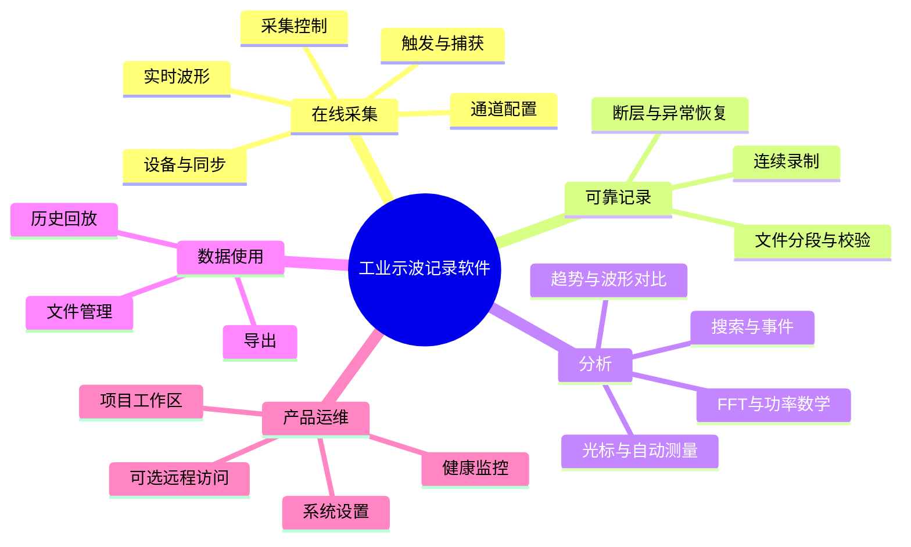

# 工业多通道示波记录软件总体规划

## 目录

1. [文档说明](#1-文档说明)
2. [项目背景](#2-项目背景)
3. [产品定位](#3-产品定位)
4. [硬件与平台基础](#4-硬件与平台基础)
5. [软件总体目标](#5-软件总体目标)
6. [软件使用流程规划](#6-软件使用流程规划)
7. [软件功能全景图](#7-软件功能全景图)
8. [软件页面与导航规划](#8-软件页面与导航规划)
9. [主要功能详细规划](#9-主要功能详细规划)
10. [功能优先级规划](#10-功能优先级规划)
11. [功能依赖和冲突矩阵](#11-功能依赖和冲突矩阵)
12. [数据和文件规划](#12-数据和文件规划)
13. [非功能规划](#13-非功能规划)
14. [研发阶段规划](#14-研发阶段规划)
15. [风险清单](#15-风险清单)
16. [待确认事项](#16-待确认事项)
17. [软件规划总结](#17-软件规划总结)

---

## 1. 文档说明

### 1.1 文档目的

明确产品边界、首版范围以及硬件与软件约束，为需求规格、交互原型、软件架构、算法规格和测试计划提供统一基线。

### 1.2 状态与优先级术语

| 标记 | 定义 |
|---|---|
| **规划项** | 已纳入软件路线、后续转入需求规格的软件方案 |
| **待确认** | 口径尚未统一或参数尚未确定的事项，数值写作 `TBD` |
| **P0/P1/P2/待确认** | 首版核心/第二阶段增强/后续增强/未决定是否进入路线图 |

术语：采集指从 FPGA 经 PCIe/Xillybus 接收原始数据；录制指将数据持续写入 NVMe；显示指面向观察的降采样波形；捕获指围绕触发事件保存有限窗口；断层指数据序列存在已识别缺口；项目指通道、显示、触发、分析和存储策略的可保存工作配置集合。

---

## 2. 项目背景

本项目面向工业现场的多通道、长时间、高吞吐数据采集。采集硬件负责信号数字化、固定格式输出、同步时钟和基础触发控制；软件负责硬件识别和配置、数据接收、质量监控、实时显示、可靠录制、事件捕获、回放、分析与结果管理。

它不是单一普通示波器界面：除瞬态观察外，还强调 64 通道、512 MB/s 满载流和连续记录；它也不是单纯数据记录器：需要实时触发、波形交互、测量与频谱；更不是纯离线分析工具：采集链路存活、设备健康和数据可追溯性具有最高工程约束。

软件范围包括功能定义、信息架构、版本优先级、依赖冲突、质量目标、风险和待确认清单。

---

## 3. 产品定位

### 3.1 推荐定位

本软件定位为“工业级 64 通道同步数据采集、实时示波、长时间记录、事件捕获与离线分析一体化上位机”。核心角色包括：

- 多通道数据采集与硬件控制平台；
- 实时波形显示和基础测量平台；
- 512 MB/s 级长时间连续记录平台；
- 触发、事件捕获和数据断层追踪平台；
- 大文件回放、检索和离线分析平台；
- 工业设备状态监测与故障诊断平台。

### 3.2 主要用户

- 研发与试验工程师：调试多路电信号、观察瞬态并对比测试批次；
- 工业现场与运维工程师：长时间记录、查看趋势、定位异常时刻；
- 测试与质量人员：按统一项目配置执行试验并导出可追溯结果；
- 算法/数据人员：读取原始记录，进行离线测量、FFT 和二次分析；
- 设备管理员：维护存储、网络、版本、日志与自检。

### 3.3 典型场景

1. 上电后自动识别 8 张采集卡，检查同步、存储和温度，加载项目后开始 64 通道采集。
2. 实时观察选定通道，同时后台以满载吞吐连续录制，显示负载不得反向阻塞采集和录制。
3. 设置基础边沿触发，保存触发点前后数据并在事件列表中定位。
4. 运行数小时至数天的试验，实时查看吞吐、断层、SSD 余量和设备告警。
5. 打开超大历史记录，按时间定位、缩放、测量、FFT、搜索并导出局部结果。

---

## 4. 硬件与平台基础

### 4.1 基础条件表

| 类别 | 基础条件 | 对软件规划的约束 |
|---|---|---|
| 生产平台 | RK3588，4×Cortex-A76 + 4×Cortex-A55 | ARM64 异构核；CPU、内存带宽、热降频需在真机测量 |
| 操作系统 | Linux | 设备节点、权限、NVMe、系统时间、日志和升级均按 Linux 产品化规划 |
| 技术方向 | C++20、Qt 6.8+、Qt Quick/QML、Qt RHI | 统一桌面应用、交互界面与图形渲染技术方向 |
| 采集接口 | Xillybus PCIe DMA；8 个数据流节点与 8 个寄存器控制节点 | 软件需识别逐卡设备节点、读流、配置寄存器并处理断开/重连 |
| 板卡/通道 | 8 卡×8 通道=64 通道 | P0 以 64 通道为验收规模；扩容不纳入首版范围 |
| 采样率 | 2 MHz/通道 | 其他可选采样率由硬件能力查询结果决定 |
| 数据 | 32-bit float | 应确认字节序、NaN/Inf、满量程和校准后的语义 |
| 交织 | 每卡固定 8-wide：ch0[0]…ch7[0]、ch0[1]…；不足通道补 0.0f | 关闭通道不等于输入流变窄；吞吐与断层判定需按固定帧宽理解 |
| 数据块规模 | 4 MB，1,048,576 float | 用于容量估算；具体软件缓冲设计留待详细设计 |
| 满载吞吐 | 512 MB/s | 录制、监控和压测按持续吞吐验收 |
| FPGA 配置 | 寄存器含校准、分频、触发/时钟、主卡、软触发、ADC、量程、采样率、通道数和板地址 | 所有可写字段须有能力查询、合法性校验、状态回读和写入失败反馈；具体值域 TBD |
| 多卡同步 | PXIe 100 MHz 时钟、PXI 触发；卡 0 为主卡，软触发启动 | 同步是否成功、允许偏差、重同步策略和单卡退出规则仍须硬件确认 |
| 存储 | 2 TB NVMe，持续写入≥600 MB/s | 理论余量约 88 MB/s；必须验证热态、盘满、寿命和系统开销后的有效余量 |
| 连续记录 | 正常工况 512 MB/s、0 丢失；故障时允许降级并显式标记断层 | 不能静默丢样；显示和一般分析必须可降级 |
| 任务优先级 | 事件捕获 > FFT > 显示；波形显示只是消费者之一 | 结合采集链路存活和录制正常工况零丢失，形成资源仲裁策略 |
| 显示目标 | 60 FPS，缩放响应<50 ms | 属目标值，须在“满载采集+录制”组合工况验收 |
| 稳定目标 | 72 h 连续运行、内存无持续增长 | 24 h 作为阶段验证门槛，72 h 作为发布验证目标 |
| 异常原则 | 资源耗尽时允许应急丢弃以保持 PCIe/DMA 存活，并标记丢失 | DMA 存活与数据完整性必须分别展示，不能用“仍在运行”掩盖断层 |

### 4.2 关键口径

- **长稳时长**：24 h 作为阶段验证门槛，72 h 作为发布验证目标，两个场景均要求内存无持续增长。
- **数据完整性**：正常工况数据零丢失；异常工况优先保持 DMA 链路存活，所有缺口必须可检测、可定位、可追溯。
- **文件体系**：连续记录、触发捕获和分析结果采用相互独立且可关联的文件类型；格式开放程度和版本兼容策略待定。
- **采样率/量程**：寄存器可配置不等于所有数值均被硬件支持。UI 选项必须来自硬件能力表，当前为 TBD。

---

## 5. 软件总体目标

### 5.1 功能目标

P0 建立从设备检查、64 通道同步采集、实时显示、基础触发、可靠录制到历史回放和基础分析的闭环；提供项目配置、文件管理、健康监控、日志和明确异常提示。P1 加入捕获、搜索、趋势、功率/数学、对比和恢复工具。P2 评估自动判定、复杂事件、插件、远程控制、多机和脚本自动化。

### 5.2 性能目标

| 指标 | 规划目标 | 状态/验收工况 |
|---|---|---|
| 输入吞吐 | 512 MB/s 持续接收 | 8 卡×8 通道×2 MSPS×4 B |
| 录制吞吐 | 正常工况持续 512 MB/s、0 丢失 | 热态 NVMe、采集+显示同时运行 |
| 显示 | 目标 60 FPS，缩放反馈<50 ms | 帧率允许按负载降级，降级阈值 TBD |
| 数据完整性 | 正常工况零断层；异常缺口 100% 被标记并计数 | “100%识别”是规划项，需用可控故障注入验证 |
| 启停 | UI 给出即时受理反馈；安全停采/停录时间 TBD | 不以强退进程替代停机完成 |
| 长稳 | 建议 P0 24 h 门槛、发布候选 72 h，内存无持续增长 | 时长口径待确认 |
| 内存 | 固定上限、无随录制时长线性增长；上限 TBD | 需根据 RK3588 实际内存容量确定 |
| 磁盘 | 录制前预估容量和时长，设置安全余量；阈值 TBD | 禁止写满系统盘导致系统失效 |

### 5.3 质量目标

- 稳定性：任何单一 UI/分析失败不拖垮采集链路；可预期停止优于无响应。
- 可维护性：硬件能力、业务状态、显示与分析边界清楚；日志可按一次试验关联。
- 可扩展性：通道属性、分析任务、导出器和页面可扩展，但 P0 不先建设通用插件平台。
- 易用性：主流程在一个工作区完成；高风险操作有原因、影响和恢复建议。
- 故障可定位：显示板卡、吞吐、序号/断层、存储速度、资源水位、温度和关联日志。
- 异常恢复：配置可恢复；录制异常停止后可校验、封存或修复，原文件不被二次破坏。
- 数据可追溯：记录硬件标识、时间基准、通道/采样配置、校准版本、软件版本和缺口。

---

## 6. 软件使用流程规划

| 阶段 | 用户看到 | 可执行操作 | 错误反馈与恢复 |
|---|---|---|---|
| 1 启动 | 版本、启动进度、系统/权限/NVMe检查 | 查看详情、进入离线模式 | 明确失败项、影响和修复建议，不用无限加载 |
| 2 硬件识别 | 8 卡槽位、设备节点、序列号/地址、连接态 | 刷新、重连、打开诊断 | 缺卡、重复地址、权限或节点异常分别提示 |
| 3 状态检查 | 同步、时钟、温度、盘速/余量、自检摘要 | 运行自检、选择可用卡 | 阻断项与警告项分级；允许离线回放 |
| 4 卡/通道配置 | 通道列表、能力值、启用/显示/录制选择 | 命名、颜色、单位、量程等 | 不支持的值拒绝提交并保留原值 |
| 5 采样设置 | 采样率、同步主卡、触发基本项 | 应用配置、保存模板 | 采集中不可改的字段置灰并解释生效时机 |
| 6 开始采集 | 启动进度、各卡数据率、同步状态 | 取消启动、安全停止 | 部分卡失败时按系统策略全停或降级 |
| 7 实时观察 | 波形、通道标签、断层、帧率 | 缩放、平移、暂停显示、自动适配 | 无数据与平线、断层、渲染降级必须可区分 |
| 8 触发/测量 | 触发状态、光标和测量卡片 | 设置基础边沿、增删测量 | 源关闭/无效窗口时显示原因，不给虚假数值 |
| 9 开始录制 | 路径、预计时长、写速、余量 | 开始、停止、查看详情 | 预检失败阻止开始；运行中异常转告警/安全停止 |
| 10 停止 | 排空/封存/校验进度 | 等待、查看日志 | 超时显示所处步骤；文件仅在封存和校验成功后标记为可用 |
| 11 打开历史 | 文件元数据、校验结果、时间范围 | 打开、取消、只读修复副本 | 损坏区间、可读范围和恢复选择清晰提示 |
| 12 回放分析 | 时间轴、波形、测量/FFT/搜索 | 播放、定位、缩放、分析 | 大任务显示进度、允许取消、保留已有结果 |
| 13 导出 | 范围、通道、格式、预计大小 | 开始/取消/选择新路径 | 空间不足、同名、部分失败均有清单 |
| 14 保存项目 | 变更摘要、保存位置 | 保存、另存、放弃 | 原子保存失败不破坏上次有效配置 |
| 15 退出 | 未保存/采集/录制任务摘要 | 停止后退出、取消退出 | 采集或录制中禁止无提示退出；异常退出可诊断 |

---

## 7. 软件功能全景图

### 7.1 功能树

### 7.2 功能域清单与范围

| 功能域 | 规划子功能 | 初始级别 |
|---|---|---|
| 项目与工作区 | 新建/打开/保存/最近项目、布局、功能页、崩溃后配置恢复、未保存提示 | P0 |
| 设备管理 | 发现、连接态、卡号/地址、能力、初始化、重连、缺卡/单卡故障、自检入口 | P0 |
| 通道管理 | 开关、名称、颜色、单位、量程、偏移、探头比例、反转、线性变换、相位补偿、批量设置、状态 | P0 基础；P1 变换/补偿 |
| 采集控制 | 启停、暂停显示、采样率、卡/通道选择、计数、断层、同步、异常与恢复 | P0 |
| 实时波形 | 多通道、时基/量程、平移缩放、自动适配、滚动/更新、网格/零线/标签/颜色、断层、多窗格 | P0 基础；P1 多窗格 |
| 触发 | 开关、源、边沿、电平、迟滞、位置、前后数据、自动/正常/单次/手动、状态与事件 | P0 仅硬件确认的基础边沿能力；其他待确认 |
| 连续录制 | 通道、命名/路径、容量预估、时间/容量/余量、分段、盘满/写速、断层、掉电恢复、结果管理 | P0 |
| 触发捕获 | 条件、前后长度、次数、单次/连续、列表、查看、保存、失败提示 | P1，硬件/软件触发分工待确认 |
| 历史记录与回放 | 列表、打开/校验、时间轴、播放/暂停/变速/段跳转/缩放、离线测量/FFT/搜索、损坏提示 | P0 基础；P1 离线搜索/修复 |
| 光标 | 时间/幅值光标、联动、差值、频率换算、吸附、实时/回放结果 | P0 基础；P1 吸附 |
| 自动测量 | 最大/最小/峰峰/平均/RMS/周期/频率/脉宽/占空比/边沿时间/面积/计数；当前/统计/无效/清零/源 | P0 基础；完整清单 P1 |
| 搜索 | 电平、边沿、脉宽、周期、欠幅、超限、事件、标记；范围/条件/结果/跳转/取消/进度 | P1；类型逐项确认 |
| FFT 与频谱 | 源、点数、范围、采样率、频率范围/分辨率、窗、平均、实/虚/幅/对数/相位、峰值、光标、实时/离线/导出 | P0 基础幅频谱；其余 P1 |
| 功率和数学 | 电压/电流源、有功/无功/视在功率、功率因数、RMS、四则运算、表达式、结果与非法提示 | P1；需求未确认部分不进 P0 |
| 趋势分析 | 趋势源、统计量、采样周期/时长、实时/历史、游标、缩放、导出、缺失显示 | P1 |
| 事件分析 | 条件、时间、持续时间、次数、列表、定位、等级、确认、导出 | P1 基础；复杂事件 P2 |
| GO-NOGO | 模板、上下限、范围/次数、通过/失败/连续失败、停采/停录/保存/告警动作 | 待确认 |
| 标记/轨迹/对比 | 手动/自动标记、名称/跳转、参考轨迹、时间/幅值对齐、差值和结果 | P1；自动标记待确认 |
| X-Y 显示 | X/Y 源、范围、点数、缩放、光标、暂停、回放 X-Y | P2 |
| 文件与导出 | 列表/信息/重命名/删除/校验/恢复、CSV/MAT/原始/测量/FFT、进度/取消/空间不足 | P0 基础；MAT/恢复 P1 |
| 系统状态与健康 | 各卡/采集态、数据率、丢失、缓存水位、写速/余量、CPU/内存/温度、运行时长、告警/日志/诊断包 | P0 |
| 系统设置 | 日期时间、显示、网络、存储、日志、默认项目、自启、版本/升级、默认配置、自检 | P0 基础；在线升级 P1 |
| 远程访问 | 状态/波形/启停/文件、权限/认证/审计、断网处理 | P2 可选 |

---

## 8. 软件页面与导航规划

### 8.1 信息架构

采用“全局状态栏 + 主工作区 + 左侧功能导航 + 右侧参数检查器 + 底部任务/告警抽屉”。全局状态栏始终显示设备、采集、触发、录制、吞吐、断层、磁盘和告警；参数页不能遮挡严重告警。实时与回放使用明确模式标识，避免把历史波形误认为实时数据。

### 8.2 页面规划表

| 页面 | 目的与主要内容 | 主要操作/跳转 | 空/加载/错误状态 | 采集中访问与修改 |
|---|---|---|---|---|
| 启动与设备检查 | 启动进度、卡槽、同步、存储、自检摘要 | 重试、诊断、离线回放→主工作区 | 无卡、缺卡、权限、同步/盘异常 | 不适用 |
| 主波形工作区 | 实时波形、通道标签、全局状态、快捷测量 | 通道/采集/触发/录制/分析 | 无有效通道、等待首帧、断层、渲染降级 | 允许；硬件关键参数锁定 |
| 通道设置 | 通道属性和批量配置 | 应用、撤销、能力详情 | 卡缺失、能力读取失败 | 名称/颜色可改；量程等按硬件规则 |
| 采集设置 | 采样、卡选择、同步主从、启动策略 | 应用→主波形 | 参数冲突、同步不满足 | 关键项只读，停采后生效 |
| 触发设置 | 源、边沿、电平、迟滞、模式、前后位置 | 事件列表/捕获 | 源关闭、类型不支持、等待触发 | 允许项由硬件能力和状态决定 |
| 录制页 | 路径、通道、预估、写速、余量、分段 | 文件列表/停止确认 | 路径不可写、空间/速度不足 | 可查看；录制中关键项锁定 |
| 捕获页 | 捕获条件、前后窗口、次数和结果 | 捕获回看/触发页 | 等待、超时、缓冲不足 | P1；与连续录制规则联动 |
| 测量/光标页 | 测量卡片、统计、光标结果 | FFT/趋势/导出 | 无效窗口、断层、源关闭 | 可进入；重任务可能限频 |
| 搜索/事件页 | 条件、范围、结果和跳转 | 定位主波形/回放 | 无结果、取消、部分结果、数据缺口 | 实时搜索能力 TBD；离线 P1 |
| FFT 页 | 时域源、频谱、参数、峰值和光标 | 导出/回到时域 | 点数不足、断层、计算中 | 基础实时可用；负载时自动降频并提示 |
| 趋势/功率/数学 | 分析配置和结果 | 主波形/导出 | 源不匹配、单位非法、缺失 | P1；修改影响记录时需确认 |
| 回放页 | 文件信息、时间轴、波形、播放和离线分析 | 文件/搜索/测量/FFT | 校验失败、局部不可读、索引加载 | 可与实时采集并存与否待确认；资源隔离 |
| 文件管理 | 记录/捕获/导出/项目分类列表 | 打开、校验、导出、重命名、删除 | 扫描中、介质拔出、被占用 | 允许查看；禁止删除正在使用文件 |
| 系统状态 | 板卡、速率、水位、盘、CPU/内存/温度、告警 | 日志/诊断/自检 | 监控项不可读显示“未知” | 始终允许，只读为主 |
| 系统设置 | 网络、时间、存储、日志、自启、版本、自检 | 保存/恢复默认/升级 | 权限、写入、升级包错误 | 影响采集的设置锁定或预约生效 |

### 8.3 导航与状态规则

- 页面切换不停止采集或录制；需要停止的操作必须显式确认。
- 所有后台任务（录制封存、文件校验、搜索、导出、分析）进入任务中心，显示进度、可取消性和结果。
- 严重告警使用持续可见状态；一般提示使用非阻塞通知并进入日志。
- 参数面板同时展示“当前值/编辑值/生效时机/来源”，避免用户误以为编辑即已下发硬件。
- 卡片式、多窗口和快捷键作为可选交互方式，是否纳入由屏幕尺寸和操作习惯决定。

---

## 9. 主要功能详细规划

### 9.1 统一细化模板与公共反馈

每个功能在需求规格阶段继续按“目标、场景、优先级、入口、前置、子功能、参数、流程、反馈、规则、关系、异常、性能、验收”展开。公共反馈状态为：空闲、运行/处理中、等待、完成、空数据、警告、错误和已取消。任何测量/分析值必须同时带有效性；数据断层跨越计算窗口时默认不输出看似正常的结果。

公共参数字段：名称、含义、类型、单位、默认值、范围/选项、修改条件、生效时机、是否保存、数据归属、待确认标记。下列参数表中的“能力值”均指从硬件能力或经确认的配置获取。

### 9.2 项目与工作区（P0）

- **目标/场景/入口**：保存一次试验的通道、显示、触发、分析和存储策略；从启动页或“项目”菜单进入。
- **前置与子功能**：无需硬件即可新建/打开；保存、另存、最近项目、布局恢复、配置版本校验、崩溃后恢复草稿。
- **关键参数**：项目名（文本，必填，默认“未命名项目”）；路径（目录，TBD 默认）；默认采集配置（引用）；工作区布局（枚举）；自动保存周期（时长，建议值 TBD）；项目格式版本（系统生成）。名称/布局可随时改，硬件配置采集中仅预约下次生效；均保存。
- **流程与反馈**：新建/打开→校验版本和硬件能力→显示差异→用户确认降级或取消→进入工作区；保存成功、冲突、只读、版本过新、部分字段不支持均明确列出。
- **规则/关系**：项目不包含原始密码；硬件能力变化不得静默改写；录制文件嵌入或关联配置快照。异常退出恢复到草稿，不覆盖最后一次有效版本。
- **性能/验收**：打开/保存目标时延 TBD；验证原子保存、版本迁移、断电中断、缺卡打开和未保存退出。

### 9.3 设备、通道与采集控制（P0）

- **目标/场景/入口**：建立可信硬件状态并控制 8 卡同步采集；启动检查页、通道页、采集页和全局 START/STOP。
- **前置与子功能**：Linux 设备节点可访问；发现/初始化/重连、卡地址、能力、同步，通道属性、批量设置，采集启停、计数、断层和异常恢复。
- **关键参数**：卡选择（8 位集合，默认全部已发现卡）；通道启用/显示/录制（布尔/集合）；采样率（Hz，默认/选项=硬件能力值，目标 2 MHz/通道）；主卡（卡号，默认卡0，可配置性待确认）；量程/偏移/探头比/相位补偿（能力值/TBD）；名称、颜色、单位（用户值）；同步允许偏差和启动超时（TBD）。硬件项通常停采可改，下次启动或明确“应用”生效；用户显示项即时生效并保存。
- **操作流程**：发现→读能力/状态→校验卡地址和同步条件→应用通道配置→预检→同步启动→观察各卡首帧/数据率→运行→安全停止。
- **反馈/规则**：区分“设备存在、初始化成功、同步成功、数据到达”；固定 8-wide 补零通道不得被统计为真实零信号；暂停显示不暂停采集；启动中禁止重复启动。
- **关系/异常**：缺卡、节点权限、重复地址、寄存器写失败、某卡无数据、序号跳变、同步丢失均产生结构化告警。单卡故障是全停还是其余卡继续为待确认；继续时必须在全局时间轴标记受影响通道。
- **性能/验收**：满载 512 MB/s；验证 8 卡启动顺序、同步、反复启停、断开重连、单卡卡死、非法参数、连续运行和断层计数。

### 9.4 实时波形显示（P0）

- **目标/入口**：在不影响采集和录制的前提下观察 64 通道；主工作区。
- **子功能**：通道叠加/分区、时基、量程、平移缩放、自动适配、滚动/更新、网格/零线/标签、颜色、断层、暂停显示、多窗格（P1）。
- **参数**：可见通道集合、布局、水平时基、垂直缩放/偏移、刷新上限（默认目标60 FPS）、点数预算、滚动窗口、网格和抗锯齿（建议值/TBD）。显示参数即时生效并保存；不改变原始录制。
- **流程/反馈**：选通道→首帧等待→实时更新→交互缩放→暂停/恢复；显示当前时间范围、采样状态、实际 FPS、降级级别和断层标记。暂停明确标“画面已暂停，采集/录制继续”。
- **规则/关系**：显示只消费派生数据；高负载依次降低刷新率/点数/非关键效果，不能阻塞录制；缩放范围超出可用历史时显示边界。
- **异常/验收**：无数据、全零、NaN/Inf、断层、通道关闭、分辨率变化和 GPU/渲染退化；满载采集+录制下目标 60 FPS、缩放反馈<50 ms，若未达标记录实际值和降级而非丢采集数据。

### 9.5 触发与触发捕获（P0 基础触发；P1 捕获）

- **目标/入口**：稳定观察特征边沿并围绕事件保存前后波形；触发页和捕获页。
- **子功能**：触发源、上升/下降/双边沿、电平、迟滞、位置、自动/正常/单次/手动、状态/事件；捕获前后长度、次数、单次/连续、结果列表和回看。只有硬件明确支持项才可标“硬件触发”，其余为规划算法能力。
- **参数**：触发开关、源（启用通道）、边沿、阈值（通道单位）、迟滞（能力值/TBD）、模式、触发位置、前/后长度、保持时间、超时、捕获次数/保存路径。默认值及范围均须硬件确认；触发源/电平的修改条件和是否可热更新 TBD。
- **流程/反馈**：选源→读能力→设置条件→校验→布防→等待→触发→保存/回看；状态至少含未配置、已布防、等待、已触发、保存中、完成、超时、失败。
- **规则/关系**：源关闭立即使配置无效；跨断层的捕获标为不完整；连续录制与捕获可否共享全速数据须压测确认；多个动作的优先级为捕获完整性优先。
- **异常/验收**：阈值越界、源断开、前触发缓冲不足、触发过密、保存失败、用户取消。验证边沿方向、迟滞、触发点位置、前后样本数、手动/单次、超时和断层。

### 9.6 连续录制（P0）

- **目标/入口**：在正常工况以 512 MB/s 长时间可靠写入；录制页和主状态栏。
- **子功能**：通道/卡选择、命名/路径、容量和时长预估、自动分段、写速/余量、断层记录、盘满策略、异常停止、掉电后校验/恢复、结果管理。
- **参数**：保存路径、文件基名、录制选择、预计时长/容量、分段阈值、磁盘预留空间、低速告警阈值/持续时间、停止条件、校验策略（数值 TBD）。录制开始后影响文件解释的参数锁定；下次录制生效并随项目保存。
- **流程/反馈**：预检可写性/余量/基准写速→显示预算→开始→记录时间、字节、实际速率、断层、余量→停止排空→封存和校验→结果摘要。
- **规则/关系**：正常工况零丢失；显示和一般分析先降级。SSD 降速/拔除时不得阻塞 DMA；进入降级、标记缺口或安全停录，具体阈值待确认。录制文件不可在文件管理中删除/重命名。
- **异常/验收**：不可写、同名、盘满、写速不足、介质消失、掉电、进程异常和校验失败。验证 512 MB/s 热态持续写、自动分段连续性、空间预警、拔盘、限速、异常恢复和元数据可追溯。

### 9.7 历史回放、文件管理与导出（P0 基础；P1 恢复/扩展格式）

- **目标/入口**：安全打开大记录、按时间浏览并导出选定数据；文件页/回放页。
- **子功能**：分类列表、元数据/校验、时间轴、播放/暂停/变速、段跳转、缩放、重命名/删除、恢复副本、原始/CSV/测量/FFT 导出，MAT 为 P1。
- **参数**：文件/时间范围、通道集合、回放速度、缓存预算、校验级别、导出格式/精度/分隔符/路径/覆盖策略（TBD）。回放视图参数可保存；原文件只读。
- **流程/反馈**：选择→快速元数据检查→必要时后台完整校验→按需加载→回放/定位→分析→导出；展示加载/校验/导出进度、预计大小、取消和部分结果。
- **规则/关系**：导出与删除互斥；恢复生成新文件或明确备份，不原地破坏证据；超大 CSV 必须提示规模；时间轴显示分段和断层。
- **异常/验收**：文件版本过新、索引坏、局部数据坏、介质拔出、空间不足、取消和同名冲突。验证长文件随机定位、跨段播放、损坏区间隔离、取消响应和导出数值一致性。

### 9.8 光标与自动测量（P0 基础，P1 完整项）

- **目标/入口**：快速得到可解释的波形参数；主波形/回放的测量抽屉。
- **子功能**：时间/幅值双光标、联动/差值/频率换算；最大、最小、峰峰、平均、RMS、周期、频率、正/负脉宽、占空比、上升/下降时间、面积、脉冲/边沿计数；当前/最大/最小/平均/标准差/次数、清零和源选择。
- **参数**：源、测量类型、分析窗口、阈值/参考电平、迟滞、统计窗口/次数、光标位置/吸附。默认算法定义、边沿参考百分比、无效判据和单位转换 TBD；均保存为项目分析配置。
- **流程/反馈**：选源与窗口→选测量→计算→显示值、单位、有效性和统计→清零；计算中、无周期、样本不足、断层、饱和、NaN 必须显示“无效+原因”。
- **规则/关系**：关闭源时停算但保留配置；光标可用于实时与回放；测量不得对显示降采样结果冒充原始精度，数据源层级需显示。
- **性能/验收**：基础测量刷新率 TBD，不能抢占采集/录制；以标准波形、噪声、直流、断层、窄脉冲和边界窗口验证定义与误差。

### 9.9 搜索、标记与事件分析（P1）

- **目标/入口**：从长记录中快速定位满足条件的时刻；回放页/搜索事件页。
- **子功能**：电平、边沿、脉宽、周期、欠幅、超限、已有事件/标记搜索；手动/自动标记、结果列表、前后跳转、事件持续时间/次数/等级/确认/导出。
- **参数**：源、范围、类型、阈值、比较关系、迟滞、最小持续时间、结果上限、排序、事件等级。默认值和类型是否进入 P1 逐项确认；保存搜索条件但不把结果当原始数据。
- **流程/反馈**：定义范围/条件→估算成本→开始→显示进度和部分结果→定位→标记/导出；支持取消、无结果和跳过损坏区间。
- **规则/关系**：结果引用原文件时间位置和规则版本；文件变化使结果失效；跨断层事件标“不确定”。实时事件与离线搜索应复用同一语义定义但可采用不同性能策略。
- **性能/验收**：大文件扫描速度和取消时延 TBD；验证条件边界、重复事件、跨段、断层、结果稳定性与跳转准确性。

### 9.10 FFT 与频谱分析（P0 基础，P1 增强）

- **目标/入口**：查看时域窗口对应的频率组成；FFT 页，可由实时/回放波形进入。
- **子功能**：源、点数、范围、频率范围/分辨率、窗函数、平均、幅值/对数幅值；P1 增加实部、虚部、相位、峰值列表、频谱光标和更多平均模式。
- **参数**：源、采样率（只读，来自数据）、FFT 点数、起止范围、窗函数、平均模式/次数、显示单位、频率上下限、峰值门限。可选集合和默认值 TBD；频率分辨率随采样率和点数计算并显示。
- **流程/反馈**：选源/范围→校验有效样本→计算→显示频谱/分辨率→光标/峰值→导出；显示计算中、限频、取消、样本不足、断层和无效数据。
- **规则/关系**：实时 FFT 可按负载降低更新频率，事件捕获优先；离线结果记录参数快照；断层默认不跨越拼接计算。
- **性能/验收**：刷新率、最大点数和通道并发数 TBD；用单音、多音、噪声、直流、窗泄漏、幅值标定和断层验证频率/幅值误差。

### 9.11 功率、数学与趋势（P1）

- **目标/入口**：形成电压/电流组合分析、派生通道和统计量随时间变化；分析菜单。
- **子功能**：电压/电流源、有功/无功/视在功率、功率因数和 RMS；通道四则运算/受限表达式；趋势源、统计量、周期/时长、实时/历史、游标、缩放和导出。
- **参数**：源对、单位/比例、相位补偿、周期判定、数学表达式、除零策略、趋势采样周期/时长/聚合方法。算法定义、跨卡源是否允许、默认值和误差指标 TBD。
- **流程/反馈**：选源/单位→校验同步和量纲→设置范围→运行→显示结果/趋势→导出；对源不同步、单位不兼容、除零、无周期、数据缺失给出无效原因。
- **规则/关系**：功率强依赖校准和同步；数学通道不改变原始数据；趋势点必须带覆盖时间和质量标记。无明确产品需求的谐波等不自动纳入。
- **性能/验收**：刷新率和历史容量 TBD；验证同相/移相、直流/交流、缺失源、单位错误、除零、趋势聚合和断层显示。

### 9.12 GO-NOGO、X-Y 与波形对比（待确认/P1-P2）

- **目标**：提供自动判定、二维关系显示和基准波形比较。GO-NOGO 是否纳入待确认，X-Y 规划为 P2，波形对比规划为 P1。
- **子功能/参数**：判定上下限、范围、次数、连续失败和告警/停采/停录/保存动作；X/Y 源、范围和点数；参考轨迹、时间/幅值对齐、差值和容差。模板来源、动作权限、默认阈值和对齐算法均 TBD。
- **流程/反馈**：创建规则/基准→校验→试运行→启用→计数/判定→动作确认/审计；展示未校准、基准不匹配、规则冲突、通过/失败和动作失败。
- **规则/异常**：自动动作必须有权限、去抖、最大执行频率和审计；停止录制不得先于文件安全封存；断层区间不得判定为通过。
- **验收**：用边界、连续失败、动作冲突、断层、基准版本变化和权限不足验证；只有业务场景和安全策略确认后进入版本。

### 9.13 系统状态、设置与远程访问（P0 运维；P2 远程）

- **目标/入口**：让用户知道系统是否健康，并提供可控运维；全局状态栏、系统状态/设置页。
- **子功能**：各卡状态、数据率/丢失/水位、写速/余量、CPU/内存/温度/运行时长、告警/日志/诊断包；时间、显示、网络、存储、日志、自启、版本、升级、恢复默认、自检。远程状态/波形/启停/文件与认证审计为 P2。
- **参数**：采样周期、告警阈值/级别、日志级别/保留、存储目录/余量、网络、时间源、自启项目、升级通道；阈值和权限模型 TBD。安全相关配置需管理员权限和审计。
- **流程/反馈**：持续监控→阈值告警→查看关联指标/日志→执行自检或导出诊断→确认恢复；升级须预检、校验、明确重启和回滚结果。
- **规则/关系**：监控失败显示“未知”而非正常；时钟调整不得破坏采样序列；采集中限制升级/恢复默认。远程断开不改变本地任务，远程危险操作需认证、授权、幂等和日志。
- **性能/验收**：监控本身低开销，采样周期 TBD；验证高温、满盘、指标不可读、日志轮转、自检失败、升级中断、权限和断网。

---

## 10. 功能优先级规划

### 10.1 P0：首版核心闭环

设备发现/初始化/能力显示、卡与通道基础配置、64 通道同步采集、实时波形、基础边沿触发、连续录制/分段/异常提示、历史文件打开与基础回放、基础光标和测量、单通道基础 FFT、项目配置、文件列表与原始/CSV 导出、系统健康/日志、基础存储与版本信息。

P0 的边界是“真硬件、满载、可长稳、可追溯”的完整闭环，不以功能页数量衡量。MAT、复杂触发、完整测量清单或华丽多窗口不得挤占 512 MB/s 录制和异常恢复验证。

### 10.2 P1：增强分析与数据利用

触发捕获、离线搜索、趋势、事件列表、功率/数学、波形对比、完整测量项、频谱增强、自动标记/光标吸附、多窗格、MAT 等扩展导出、文件恢复工具、升级和更完整自检。

### 10.3 P2：高级与自动化

X-Y、复杂事件/时序、GO-NOGO（是否纳入待确认）、ATE、插件、远程控制、多机管理、脚本自动化。每项需单独确认业务价值、安全要求和资源预算。

### 10.4 版本准入原则

新功能必须说明数据源、资源预算、断层语义、状态/取消、日志和验收方法；若降低 P0 录制稳定性，则默认后移。可选功能先进入待确认清单，不直接排期。

---

## 11. 功能依赖和冲突矩阵

| 组合 | 同时运行 | 冲突/依赖 | 软件处理 | 用户提示 |
|---|---|---|---|---|
| 采集×录制 | 是，P0 核心 | 共享输入与内存/磁盘带宽 | 录制预检；正常工况零丢失；显示/分析先降级 | 显示写速、余量、断层和降级级别 |
| 采集×硬件参数修改 | 部分 | 量程/采样/同步可能改变数据解释 | 名称颜色即时；关键项锁定或预约停采后生效 | “当前值/待生效值/需停采原因” |
| 采集×回放 | 待确认 | CPU、内存、NVMe 读写竞争 | P0 可先互斥；若并行则限速与独立预算 | 告知录制优先和回放限速 |
| 连续录制×触发捕获 | 条件允许 | 共享原始数据、缓存和写盘 | 压测后决定；不足时保护连续录制或按产品策略 | 预估影响，拒绝时给出原因 |
| 通道关闭×测量 | 否 | 无有效源 | 停算、保留配置、结果无效 | “源已关闭” |
| 通道关闭×FFT | 否 | 无有效源 | 停算或要求换源 | “请选择启用通道” |
| 通道关闭×触发 | 否 | 触发源失效 | 禁止关闭或先解除触发布防，策略待确认 | 显示受影响触发任务 |
| 回放×实时采集 | 待确认 | 易混淆数据模式且竞争资源 | 视觉强区分；资源不足时互斥 | 顶栏持续显示“实时/回放” |
| FFT×测量 | 是，限预算 | 竞争 CPU/内存带宽 | 录制优先，FFT 降更新率，测量限频 | 显示实际更新率/降级 |
| 导出×文件删除 | 否 | 文件被占用且结果不一致 | 任务锁；删除按钮禁用 | “文件正在导出” |
| 导出×录制同盘 | 条件允许 | 写放大、盘速竞争 | 限速/暂停导出或建议其他盘 | 展示预计影响 |
| 磁盘不足×录制 | 否或安全收尾 | 继续写可能损坏系统 | 阈值预警，停止接收新录制数据并安全封存；精确策略 TBD | 分级倒计时/剩余时间/处理建议 |
| 暂停显示×后台采集 | 是 | 仅冻结可视帧 | 采集与录制继续；恢复显示取最新或历史策略 TBD | 醒目标记“显示暂停” |
| 单卡故障×其他卡采集 | 待确认 | 同步完整性和跨卡分析受损 | 全停或降级继续由产品/硬件决策；均标记时间区间 | 指明卡号、影响通道和动作 |
| 文件校验×回放 | 条件允许 | 完整校验占 I/O | 快速校验后只读回放，后台完整校验可限速 | 显示“未完整校验” |
| 系统升级×采集/录制 | 否 | 重启和文件风险 | 必须先安全停止并确认文件封存 | 列出将停止的任务 |
| 远程启停×本地操作 | 待确认 | 控制权冲突 | 权限、租约/互斥、幂等和审计 | 显示操作者、来源、时间 |

资源优先顺序建议：DMA/采集链路存活 → 正常工况录制完整性 → 触发捕获 → 必需健康监控 → FFT/测量 → 显示效果 → 导出/后台索引。录制相对于捕获的最终顺序待确认。

---

## 12. 数据和文件规划

| 数据类别 | 用途 | 长期保存/导出 | 完整性/恢复 | 版本管理 |
|---|---|---|---|---|
| 实时采集数据 | 录制、触发、分析源 | 通常不单独保存；进入记录/捕获 | 序号、时间、卡/通道、质量标记；异常缺口可定位 | 采集语义版本 |
| 显示数据 | 波形绘制 | 否；截图若纳入则独立 | 可降采样，必须保留断层标记；无需恢复 | 显示算法版本可选 |
| 连续录制文件 | 长时间原始记录 | 是；允许受控导出 | 强校验、异常封存/恢复、分段连续性 | 必须有格式版本和向后读取策略 |
| 触发捕获文件 | 事件前后窗口 | 是 | 触发参数/位置/完整性；可恢复策略 | 必须版本化 |
| 项目配置 | 重现实验配置 | 是，可导入导出 | 原子保存、校验、默认值和迁移 | 必须版本化 |
| 测量结果 | 数值/统计/有效性 | 可选长期；CSV 等 | 引用源文件/时间窗/算法参数；可重算 | 算法版本必需 |
| FFT 结果 | 频谱/峰值 | 可选长期；表格/数据导出 | 引用源和窗口参数；可重算 | 算法/参数版本必需 |
| 趋势数据 | 长时间统计量 | P1 长期保存/导出 | 每点带覆盖范围和质量标记 | 聚合规则版本 |
| 日志/告警 | 故障定位和审计 | 按保留策略，可导出诊断包 | 轮转、时间一致、空间保护 | 日志模式版本 |
| 导出文件 | 与第三方交换 | 是 | 导出清单、范围、通道、精度、是否含断层 | 导出器版本可追溯 |

高层规则：原始记录与派生结果分离；文件内或伴随清单记录硬件标识、软件版本、配置快照、时间基准、校准版本和断层。连续记录、触发捕获和分析结果使用不同的文件类别，命名、扩展名、公开程度和兼容策略在文件格式专项设计中确定。删除应二次确认并优先支持回收站或隔离区，具体保留策略 TBD。

---

## 13. 非功能规划

| 领域 | 规划要求 | 建议验收 |
|---|---|---|
| 性能/实时性 | 持续接收和录制 512 MB/s；目标 60 FPS、缩放<50 ms；后台任务可限速 | 真 RK3588+目标 NVMe，满载组合场景，不只测单模块 |
| 稳定性 | 建议 24 h 阶段门槛、72 h 发布候选；无崩溃、死锁、内存持续增长 | 时长口径确认后，含反复启停和热态 |
| 数据完整性 | 正常工况零丢失；异常缺口显式标记、计数、时间定位 | 序号审计、已知数据源、限速/拔盘/资源耗尽注入 |
| 启停响应 | 点击即时反馈；安全停止和封存有进度/超时诊断 | 各状态反复启停、启动中取消、设备阻塞 |
| UI 流畅性 | 参数操作和告警不被重计算阻塞；刷新可降级 | 64 通道显示+录制+FFT，统计帧率和交互 p95/p99（阈值 TBD） |
| 异常恢复 | 配置、索引/记录异常均有只读检查和可审计恢复路径 | 断电/进程中止点矩阵，验证原文件保护 |
| 可维护/测试 | 硬件模拟不替代真机；状态、错误码和指标可观测；算法有黄金数据 | 单元、集成、硬件在环、压力、故障注入、升级回退分层 |
| 日志 | 分级、结构化上下文、轮转、脱敏、试验关联；盘满时自保护 | 长稳日志体积、时间跳变、并发错误和诊断包 |
| 安全/权限 | 本地最小权限；危险文件、升级、网络/远程控制受权；审计 | 非授权账户、路径穿越、恶意/损坏文件、重复远程请求 |
| 软件升级 | 包完整性/来源校验、兼容检查、禁止采集中升级、失败回滚 | 断电、包损坏、版本跨越、配置迁移和回退 |
| 配置兼容 | 新版本读旧配置；未知字段不静默误用；硬件不兼容显示差异 | 多版本项目样本和缺卡/能力变化矩阵 |
| 可用性 | 关键状态全局可见；错误含原因、影响、建议；危险操作可撤销或确认 | 用户任务走查、误操作测试、离线模式 |

内存预算、CPU 占用、温度阈值、磁盘预留、告警延迟、远程安全规范和各算法误差均为 TBD，在专项验证后确定。

---

## 14. 研发阶段规划

| 阶段 | 目标/主要功能 | 前置条件 | 输出成果 | 验收重点 | 主要风险 |
|---|---|---|---|---|---|
| 0 需求和硬件确认 | 冻结 P0、硬件参数/状态/错误、数据语义、同步/触发/存储口径 | 软件范围初稿；硬件/FPGA 信息齐备 | 需求基线、硬件接口说明、交互原型、验收矩阵、关闭的关键 TBD | 所有阻断问题有责任人和结论 | 参数与真机不一致、范围膨胀 |
| 1 最小采集和显示 | 单卡、单通道数据接收，基础启停和波形，健康最小集 | 真机节点/寄存器、样例数据、时间/序号定义 | 可演示纵向切片、数据校验报告、最小 UI 原型 | 原始值/顺序、阻塞解除、反复启停、错误可见 | 接口权限、数据语义错误、停机挂起 |
| 2 多卡多通道采集显示 | 8 卡64通道、同步、通道配置、满载显示和断层 | 同步和单卡故障策略确认 | 多卡采集版本、性能基线、硬件在环报告 | 512 MB/s 输入、同步偏差、60 FPS目标/降级、长稳初测 | 内存带宽、热降频、同步漂移 |
| 3 连续录制和回放 | 满载写盘、分段、文件列表、随机回放、异常停止 | 目标 NVMe、格式高层需求、盘满策略 | 记录/回放闭环、文件格式规格、故障注入报告 | 热态 512 MB/s、0丢失、断电/拔盘/限速、跨段定位 | NVMe 抖动、文件损坏、恢复耗时 |
| 4 触发、测量和 FFT | 基础边沿触发/捕获、基础测量和单通道频谱 | 算法定义、硬件触发能力、校准/误差指标 | 算法规格、黄金数据、实时/离线一致性报告 | 触发位置、测量误差、频谱误差、满载资源仲裁 | 定义歧义、计算抢占录制 |
| 5 搜索和高级分析 | 搜索、趋势、事件、功率/数学、波形对比 | P1 商业价值和优先级确认 | P1 功能包、算法与大文件性能报告 | 大文件进度/取消、断层语义、跨源同步 | 功能面过宽、算法验收缺失 |
| 6 系统化和稳定性 | 状态/日志/诊断、自检、异常恢复、升级、发布验证 | 所有 P0 冻结、生产硬件/镜像 | 发布候选、运维手册输入、完整验证报告 | 24/72 h口径、故障矩阵、升级回退、配置兼容 | 长稳缺陷、现场环境、回滚失败 |

阶段门禁：上一阶段的关键数据正确性和不可恢复风险未关闭，不推进依赖它的高级功能；每阶段都需真硬件证据，模拟数据仅用于覆盖异常和加速回归。

---

## 15. 风险清单

| 风险 | 影响 | 可能性 | 规划应对 | 后续验证 |
|---|---|---:|---|---|
| 512 MB/s 持续吞吐 | 丢样、队列膨胀、界面卡顿 | 高 | 先建立端到端预算和降级顺序，P0 先做纵向闭环 | 满载组合压测、序号审计、资源水位 |
| RK3588 CPU 性能 | FFT/测量/显示争抢 | 高 | 每功能提交 CPU 预算；录制优先；分析限频 | 真机多场景 profile 和 p99 |
| RK3588 内存带宽 | 多次复制导致吞吐崩溃 | 高 | 规划数据派生层级和固定内存上限；详细设计审查复制次数 | 带宽计数、缓存压力、并发功能矩阵 |
| NVMe 持续写入 | 热态掉速导致断层 | 高 | 指定目标盘和热态基准；预警、分段、盘满/限速策略 | 盘空/半满/近满、温升、长写、限速注入 |
| 温度与降频 | 长时间性能不可重复 | 高 | 全局温度/频率监控和分级告警；散热为整机验收项 | 高环境温度+满载72 h候选测试 |
| 多卡同步 | 跨卡测量错误、事件错位 | 高 | 明确时间基准、允许偏差、主卡和失同步策略 | 同源信号跨卡对齐、长时漂移、重同步 |
| 波形显示性能 | UI失去交互或反压数据链 | 中高 | 显示独立可降级、点数预算、实际FPS可见 | 64通道+录制+交互组合测试 |
| 长时间内存增长 | OOM、系统失效 | 高 | 固定容量、任务生命周期、日志/缓存上限纳入需求 | 24/72 h趋势、反复开关功能和文件 |
| 数据断层未被识别 | 错误分析和质量事故 | 高 | 全链路序号/质量标记；所有派生结果传播无效性 | 注入精确缺口，检查文件/显示/测量/导出 |
| 异常断电/文件损坏 | 数小时数据不可用 | 高 | 两阶段封存思路、恢复副本、分段和校验；单独确认格式方案 | 多中断点断电矩阵和恢复回归 |
| 功能范围过大 | 首版延期、核心不稳 | 高 | P0闭环门禁，可选功能放待确认清单 | 每次范围变更评估资源/阶段影响 |
| UI 与采集资源竞争 | 满载时丢样 | 高 | 明确优先级和降级；监控实际负载 | 自动化组合场景和卡顿注入 |
| 第一版功能过多 | 测试深度不足 | 高 | 首版只保留基础触发/测量/FFT和可靠记录 | 发布准入按质量而非页面数 |
| 硬件参数与真机不一致 | 设计返工、错误验收 | 中高 | 阶段0以真机和FPGA接口信息建立权威参数表 | 设备能力读取与人工核对，每版留档 |
| 单卡故障策略不清 | 数据语义和用户预期冲突 | 高 | 结合硬件能力确定全停或降级继续 | 拔卡、无数据、失同步场景 |
| 安全和远程控制 | 未授权启停/数据泄露 | 中（若纳入） | 远程后置，先确定身份、权限、审计和网络边界 | 威胁建模、权限和断网/重放测试 |

---

## 16. 后续需结合实际情况确认事项

以下问题应进入阶段 0 的关闭清单，并为每项指定责任人、截止时间和结论证据。

### 16.1 产品范围

1. P0 是否只服务 64 通道模拟采集，是否有温度、数字总线或其他板卡计划？
2. 连续录制与事件捕获谁具有更高资源优先级？
3. 实时采集与历史回放在 P0 是否必须并行，还是可先互斥？
4. P1 的功率、趋势、搜索、捕获、对比中，哪些有明确客户/项目牵引？
5. GO-NOGO、X-Y、ATE、插件、远程、多机和脚本是否进入正式路线图？

### 16.2 硬件能力

1. RK3588 内存容量、系统镜像/内核版本、PCIe 拓扑、NVMe 型号和散热设计是什么？
2. Xillybus 设备节点的打开、阻塞、断开、取消、错误码和重连契约是什么？
3. 每张卡的稳定唯一标识、板地址写入规则、重复地址检测和热插拔支持情况是什么？
4. FPGA 能力表如何读取；量程、校准、状态、温度和错误寄存器有哪些？
5. 固定 8-wide 中的补零如何与真实 0.0 区分，是否存在通道有效位或元数据？

### 16.3 采集参数与同步

1. 2 MHz/通道是唯一模式、默认值还是最大值？支持哪些离散采样率及切换条件？
2. float 数据的字节序、物理单位、量程映射、NaN/Inf、饱和和校准语义是什么？
3. Chunk 边界是否与采样组对齐；是否有硬件序号/时间戳/丢包标志？
4. 多卡同步允许偏差、长期漂移上限和验证方法是什么？
5. 卡0是否固定主卡；主卡故障后是全停、切主还是降级？
6. 单卡无数据/失同步时，其他卡继续还是全停；跨卡分析如何标无效？

### 16.4 触发能力

1. FPGA 明确支持哪些触发类型、模式、源、边沿、阈值、迟滞和保持参数？
2. 触发前/后数据由硬件还是软件缓存，最大长度及内存预算是多少？
3. 自动、正常、单次、手动触发的精确定义和状态转移是什么？
4. 触发时间戳精度、触发点在采样组的位置和多卡广播机制是什么？
5. 捕获过密、死区、漏触发及连续捕获上限如何验收？

### 16.5 存储与文件

1. 2 TB NVMe 是否为固定 BOM；≥600 MB/s 是最低热态持续值还是标称值？
2. 系统盘和数据盘是否分离；必须保留的系统安全空间和盘满动作是什么？
3. 最长单次录制时间、最大分段大小、分段命名和文件数量上限是什么？
4. 异常故障时允许丢失的尾部时长、恢复时限和“文件可用”判据是什么？
5. `.wfm/.cap/.ana` 名称是否保留；格式是否公开，需支持多少版本向后读取？
6. CSV、MAT、原始数据的首版范围、数值精度、时间列和断层表达方式是什么？
7. 原始数据文件删除是否需要回收站、权限或保留期？

### 16.6 UI 与交互

1. 目标屏幕分辨率、触摸/鼠标键盘、全屏/窗口模式和语言要求是什么？
2. 64 通道默认如何分组、命名和配色；首版是否必须多窗口？
3. 采集中允许热改哪些参数；不可热改参数采用锁定还是预约生效？
4. 严重告警是否需要声音、继电器或外部动作？
5. 离线模式是否允许无硬件启动和进行全部回放分析？

### 16.7 分析算法

1. P0 自动测量的最终清单、阈值定义、参考标准和允许误差是什么？
2. FFT 点数、窗函数、平均、幅值单位、校准和最大实时并发通道数是什么？
3. 功率计算的接线/相位/符号约定和同步误差要求是什么？
4. 断层、NaN、饱和和样本不足时各算法的统一无效规则是什么？
5. 实时与离线算法是否必须逐位一致，还是允许误差等价？

### 16.8 远程、安全与升级

1. 是否需要局域网远程查看或控制；只读和控制是否分版本？
2. 身份认证、角色、默认端口、加密、会话超时和操作审计要求是什么？
3. 远程与本地控制冲突时谁优先，网络断开后任务是否继续？
4. 升级包来源/签名、离线升级方式、A/B或其他回滚机制是什么？
5. 设备是否涉及等保、出口管制、客户内网或数据脱敏要求？

### 16.9 验收指标

1. 长稳最终是 24 h、72 h 还是两级门槛；“0 内存泄漏”如何量化为可测判据？
2. 60 FPS 是所有64通道同时显示、何种分辨率下的硬指标还是目标值？最低可接受降级帧率是多少？
3. 缩放<50 ms 的起止点、p95/p99口径是什么？
4. 正常工况定义包含哪些同时运行功能和磁盘填充率/温度条件？
5. 异常工况允许丢数据时，缺口检测率、告警延迟和允许恢复时间是多少？
6. 采集启停、录制封存、文件打开/定位、搜索/导出的性能门槛分别是什么？

---

## 17. 软件规划总结

推荐将产品建设为以“可信采集与可靠记录”为主轴、实时示波和基础分析为闭环、P1/P2 分阶段扩展的工业多通道软件。首版聚焦 RK3588/Linux 平台上的 8 卡64通道同步采集、512 MB/s 正常工况零丢失录制、可降级显示、基础触发/测量/FFT、回放、项目和健康诊断。

后续优先发展能提高长记录利用效率的触发捕获、搜索、趋势、事件、功率/数学和波形对比；GO-NOGO、X-Y、ATE、插件、远程和多机只有在业务、安全与资源预算明确后再进入版本。

当前最大风险不是单一算法，而是 512 MB/s 数据链在 RK3588 CPU/内存带宽、NVMe 热态写入和温度降频共同作用下的长时间确定性，以及多卡同步和异常断电后的数据可信度。详细设计前必须先关闭采样/数据语义、同步容差、单卡故障、触发能力、盘满/拔盘、文件兼容、资源优先级和 24 h/72 h 验收口径等阻断问题。
